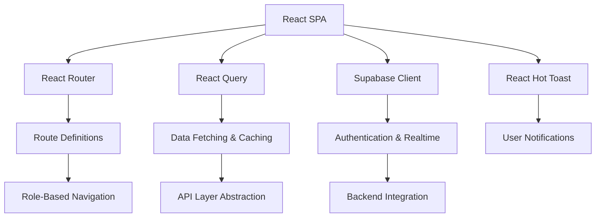
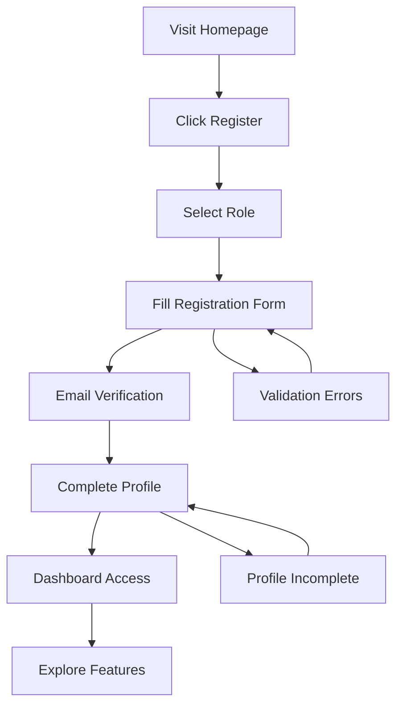
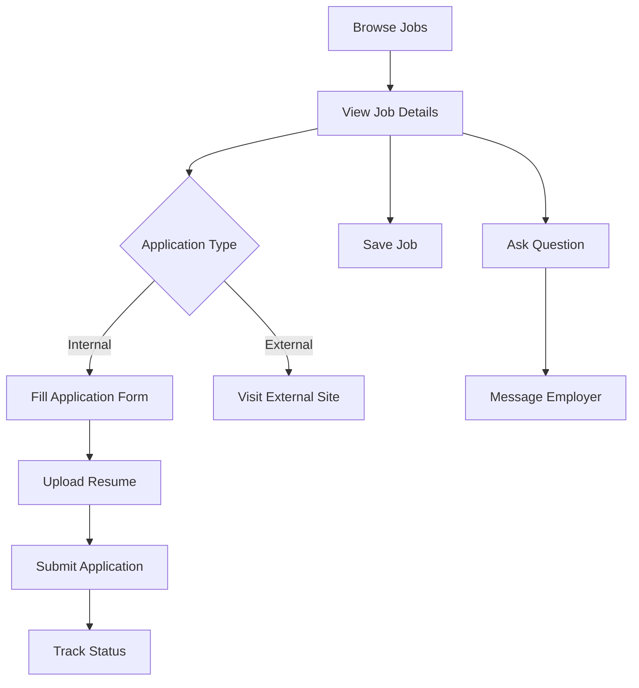
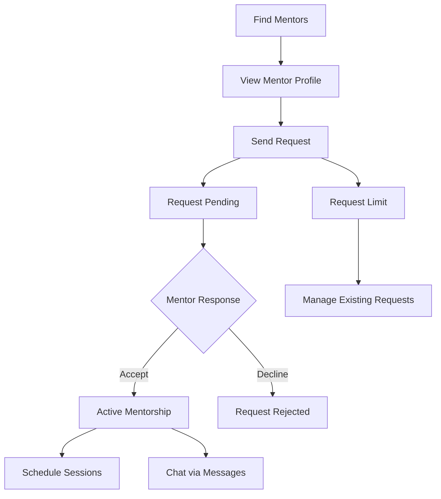

# AMET Alumni Frontend - Detailed Architecture Guide

> **🎯 Purpose**: This guide provides comprehensive explanations of each frontend section with real examples, code snippets, and visual breakdowns to help you understand the complete architecture.

---

## 📋 Table of Contents

1. [High-Level Overview](#1-high-level-overview)
2. [Entry Point & Global Layout](#2-entry-point--global-layout)
3. [Navigation & Header](#3-navigation--header-ux-shell)
4. [Routing & Major Pages](#4-routing--major-pages)
5. [Auth, Permissions & Guarding](#5-auth-permissions--guarding)
6. [Key UX Patterns & Conventions](#6-key-ux-patterns--conventions)
7. [Feature Flow Summaries](#7-feature-flow-summaries)
8. [Module Deep Dives](#8-module-deep-dives)
9. [Shared Infrastructure](#9-shared-infrastructure)
10. [Role-Based Behaviors](#10-role-based-behaviors)
11. [Security Model](#11-security-model)
12. [Development Guidelines](#12-development-guidelines)

---

## 1. High-Level Overview

### 🏗️ Architecture Overview



### 📦 Core Technologies

| Technology | Purpose | Key Files |
|------------|---------|-----------|
| **React 18** | UI Framework | `src/App.js`, all components |
| **React Router** | Client-side routing | `src/App.js` (Routes definition) |
| **React Query** | Server state management | `src/hooks/`, `src/api/` |
| **Supabase** | Backend-as-a-Service | `utils/supabase.js` |
| **Material-UI** | UI Component Library | `src/components/` |
| **React Hot Toast** | Notification system | `src/index.js`, components |

### 🎭 Role-Based Design

The app supports **5 primary roles** with different capabilities:

```javascript
// Role hierarchy (most privileged to least)
const ROLES = {
  SUPER_ADMIN: 'super_admin',  // Platform-level control
  ADMIN: 'admin',              // Tenant/Institution control
  ALUMNI: 'alumni',            // Graduate members
  STUDENT: 'student',          // Current students
  EMPLOYER: 'employer'         // Corporate partners
};
```

**Key Design Principles:**
- ✅ **Single Page Application** - No full page reloads after initial load
- ✅ **Role-gated navigation** - Menu items and routes filtered by user role
- ✅ **Progressive enhancement** - Core features work without JavaScript
- ✅ **Mobile-first responsive design** - Works on all screen sizes

---

## 2. Entry Point & Global Layout

### 🚀 Application Bootstrap (`src/index.js`)

```javascript
// Key responsibilities of index.js
1. Render React app into DOM
2. Apply React StrictMode for development
3. Configure mobile navigation provider
4. Silence console logs in production
5. Initialize error boundaries
```

**Code Structure:**
```jsx
// src/index.js
import React from 'react';
import ReactDOM from 'react-dom/client';
import App from './App';
import { MobileNavProvider } from './contexts/MobileNavContext';

// Production optimization
if (process.env.NODE_ENV === 'production') {
  console.log = () => {};
  console.warn = () => {};
  console.error = () => {};
}

const root = ReactDOM.createRoot(document.getElementById('root'));
root.render(
  <React.StrictMode>
    <MobileNavProvider>
      <App />
    </MobileNavProvider>
  </React.StrictMode>
);
```

### 🏛️ Main Application Structure (`src/App.js`)

#### Provider Stack
```jsx
// Order matters! Each provider wraps the next
<BrowserRouter>
  <QueryClientProvider>
    <AuthProvider>
      <RealtimeProvider>
        <NotificationProvider>
          <AuthListener>
            <FeedbackWidget>
              <Toaster>
                <AppContent /> {/* Main app logic */}
              </Toaster>
            </FeedbackWidget>
          </AuthListener>
        </NotificationProvider>
      </RealtimeProvider>
    </AuthProvider>
  </QueryClientProvider>
</BrowserRouter>
```

#### Layout Logic
```javascript
// AppContent determines layout based on auth state
const AppContent = () => {
  const { user, profile, loading, rejectionStatus } = useAuth();
  
  if (loading) return <LoadingSpinner />;
  if (rejectionStatus) return <RejectionPage />;
  if (!user) return <PublicRoutes />; // Login, register, etc.
  
  return <AuthenticatedLayout />; // Sidebar + header + main content
};
```

### 📱 Responsive Layout System

**Desktop Layout:**
```
┌─────────────┬─────────────────────────────────┐
│             │ Header (user menu, notifications) │
│   Sidebar   ├─────────────────────────────────┤
│  Navigation │                                 │
│             │        Main Content             │
│             │        (Routes)                 │
│             │                                 │
└─────────────┴─────────────────────────────────┘
```

**Mobile Layout:**
```
┌─────────────────────────────────┐
│ ☰  Header (user menu, notifications) │
├─────────────────────────────────┤
│                                 │
│        Main Content             │
│        (Routes)                 │
│                                 │
│                                 │
└─────────────────────────────────┘
// Sidebar slides in from left when hamburger clicked
```

---

## 3. Navigation & Header (UX Shell)

### 🧭 Navigation System (`components/Layout/Navigation.js`)

#### Role-Based Menu Logic
```javascript
const menuItems = [
  { path: '/dashboard', label: 'Dashboard', requiredPermission: 'access:dashboard' },
  { path: '/directory', label: 'Alumni Directory', requiredPermission: 'view:alumni_directory', hideFor: ['employer'] },
  { path: '/events', label: 'Events', requiredPermission: 'access:events' },
  { path: '/jobs', label: 'Job Portal', requiredPermission: 'view:jobs' },
  { path: '/mentorship', label: 'Mentorship', requiredPermission: 'request:mentorship' },
  { path: '/groups', label: 'Groups', requiredPermission: 'access:groups', hideFor: ['employer'] },
  { path: '/messages', label: 'Messages', requiredPermission: 'message:users' },
];
```

#### Active State Management
```javascript
const isActive = (path) => {
  const currentPath = location.pathname;
  return currentPath === path || currentPath.startsWith(path + '/');
};

// CSS classes applied based on state
const linkClasses = `
  flex items-center px-4 py-2 text-sm font-medium rounded-lg
  transition-colors duration-200
  ${isActive(item.path) 
    ? 'bg-primary-100 text-primary-700 border-l-4 border-primary-600' 
    : 'text-gray-600 hover:bg-gray-50 hover:text-gray-900'
  }
`;
```

### 🎨 Header Component (`components/Layout/Header.js`)

#### User Menu Structure
```jsx
// Header breaks down into 3 sections
<div className="flex items-center justify-between h-16">
  {/* Left: Mobile menu toggle */}
  <button onClick={toggleMobileNav} className="lg:hidden">
    <MenuIcon />
  </button>
  
  {/* Center: Branding */}
  <div className="flex-1 text-center">
    <h1 className="text-xl font-semibold text-gray-900">AMET Alumni</h1>
    <p className="text-sm text-gray-500">Connecting Mariners Since 1993</p>
  </div>
  
  {/* Right: User menu */}
  <DropdownMenu>
    <DropdownMenuTrigger>
      <Avatar src={user.avatar} alt={user.name} />
    </DropdownMenuTrigger>
    <DropdownMenuContent>
      <DropdownMenuItem>Profile</DropdownMenuItem>
      <DropdownMenuItem>Settings</DropdownMenuItem>
      <DropdownMenuSeparator />
      <DropdownMenuItem onClick={logout}>Sign out</DropdownMenuItem>
    </DropdownMenuContent>
  </DropdownMenu>
</div>
```

---

## 4. Routing & Major Pages

### 🛣️ Route Architecture

The routing system uses a **hierarchical approach** with nested guards and layouts:

```javascript
// Route structure in App.js
<Routes>
  {/* Public routes */}
  <Route path="/" element={<HomePage />} />
  <Route path="/login" element={<Login />} />
  <Route path="/register" element={<EnhancedRegister />} />
  
  {/* Protected routes */}
  <Route path="/dashboard" element={
    <ProtectedRoute requiredPermission="access:dashboard">
      <RequireCompleteProfile>
        <AlumniDashboard />
      </RequireCompleteProfile>
    </ProtectedRoute>
  } />
  
  {/* Module routes with role-specific guards */}
  <Route path="/jobs/*" element={
    <ProtectedRoute requiredPermission="view:jobs">
      <JobsPage />
    </ProtectedRoute>
  } />
  
  {/* Admin routes */}
  <Route path="/admin/*" element={
    <AdminGate>
      <AdminPage />
    </AdminGate>
  } />
</Routes>
```

### 📄 Page Categories

#### 1. **Core App Pages**
- `/dashboard` - Main landing page after login
- `/profile` - User profile settings
- `/settings/notifications` - Notification preferences

#### 2. **Feature Modules**
- `/directory` - Alumni directory with search/filters
- `/jobs/*` - Job marketplace with multiple sub-routes
- `/events/*` - Event management and registration
- `/mentorship` - Mentorship hub with tabbed interface
- `/groups/*` - Community groups and discussions
- `/messages` - Direct messaging system

#### 3. **Admin Tools**
- `/admin/users` - User management dashboard
- `/admin/analytics` - Platform analytics
- `/admin/settings` - Admin configuration

### 🔄 Route Guards Explained

```javascript
// 1. ProtectedRoute - Permission-based access
const ProtectedRoute = ({ children, requiredPermission }) => {
  const { hasPermission } = useAuth();
  
  if (!hasPermission(requiredPermission)) {
    return <Navigate to="/access-denied" replace />;
  }
  
  return children;
};

// 2. RequireCompleteProfile - Profile completion check
const RequireCompleteProfile = ({ children }) => {
  const { profile } = useAuth();
  
  if (!isProfileComplete(profile)) {
    return <Navigate to="/complete-profile" replace />;
  }
  
  return children;
};

// 3. ApprovedGuard - Employer approval check
const ApprovedGuard = ({ require, children }) => {
  const { isApprovedEmployer } = useAuth();
  
  if (require === 'approved-employer' && !isApprovedEmployer) {
    return <Navigate to="/employer-pending" replace />;
  }
  
  return children;
};
```

---

## 5. Auth, Permissions & Guarding

### 🔐 Authentication Context (`contexts/AuthContext.js`)

#### Core State Management
```javascript
const AuthContext = createContext();

export const AuthProvider = ({ children }) => {
  const [user, setUser] = useState(null);
  const [profile, setProfile] = useState(null);
  const [loading, setLoading] = useState(true);
  
  // Centralized auth state
  const authState = {
    user,           // Supabase auth user
    profile,        // Extended profile data
    loading,        // Loading state
    userRole,       // Normalized role (alumni, student, etc.)
    isAdmin,        // Admin/super_admin check
    isFullyApproved,// Account approval status
    hasPermission,  // Permission checker function
    rejectionStatus // Rejected/blocked status
  };
  
  return <AuthContext.Provider value={authState}>{children}</AuthContext.Provider>;
};
```

#### Permission System
```javascript
// BASE_PERMISSIONS mapping
const BASE_PERMISSIONS = {
  alumni: {
    'access:dashboard': true,
    'view:alumni_directory': true,
    'access:events': true,
    'view:jobs': true,
    'apply:jobs': true,
    'request:mentorship': true,
    'access:groups': true,
    'message:users': true
  },
  student: {
    'access:dashboard': true,
    'view:alumni_directory': true,
    'access:events': true,
    'view:jobs': true,
    'apply:jobs': true,
    'request:mentorship': true,
    'access:groups': true,
    'message:users': true
  },
  employer: {
    'access:dashboard': true,
    'access:events': true,
    'view:jobs': true,
    'post:jobs': true,
    'view:job_applications': true,
    'message:users': true
    // Note: No directory or groups access
  },
  admin: {
    'access:all': true, // Superuser permission
    // Inherits all other permissions
  },
  super_admin: {
    'access:all': true,
    // Additional platform-level permissions
  }
};
```

### 🛡️ Guard Components

#### ProtectedRoute Implementation
```jsx
const ProtectedRoute = ({ children, requiredPermission, allowRoles, isSuperAdminOnly }) => {
  const { user, getUserRole, hasPermission } = useAuth();
  const location = useLocation();
  
  // Check authentication
  if (!user) {
    return <Navigate to="/login" state={{ from: location }} replace />;
  }
  
  // Check super admin requirement
  if (isSuperAdminOnly && getUserRole() !== 'super_admin') {
    return <Navigate to="/access-denied" replace />;
  }
  
  // Check role restrictions
  if (allowRoles && !allowRoles.includes(getUserRole())) {
    return <Navigate to="/access-denied" replace />;
  }
  
  // Check permission requirements
  if (requiredPermission && !hasPermission(requiredPermission)) {
    return <Navigate to="/access-denied" replace />;
  }
  
  return children;
};
```

#### Usage Examples
```jsx
// Different guard combinations
<ProtectedRoute requiredPermission="view:jobs">
  <JobListingsPage />
</ProtectedRoute>

<ProtectedRoute requiredPermission="post:jobs" allowRoles={['employer', 'admin']}>
  <PostJobForm />
</ProtectedRoute>

<ProtectedRoute isSuperAdminOnly>
  <SuperAdminPanel />
</ProtectedRoute>
```

---

## 6. Key UX Patterns & Conventions

### 🎨 Design System

#### Color Palette
```css
:root {
  --primary-50: #eff6ff;
  --primary-500: #3b82f6;
  --primary-600: #2563eb;
  --primary-700: #1d4ed8;
  
  --success-500: #10b981;
  --warning-500: #f59e0b;
  --error-500: #ef4444;
  
  --gray-50: #f9fafb;
  --gray-900: #111827;
}
```

#### Typography Scale
```css
.text-xs { font-size: 0.75rem; line-height: 1rem; }
.text-sm { font-size: 0.875rem; line-height: 1.25rem; }
.text-base { font-size: 1rem; line-height: 1.5rem; }
.text-lg { font-size: 1.125rem; line-height: 1.75rem; }
.text-xl { font-size: 1.25rem; line-height: 1.75rem; }
.text-2xl { font-size: 1.5rem; line-height: 2rem; }
```

### 📱 Responsive Design Patterns

#### Mobile-First Approach
```jsx
// Component structure for responsive design
const Card = ({ children }) => (
  <div className="
    w-full
    p-4 md:p-6
    bg-white rounded-lg shadow-sm
    border border-gray-200
    hover:shadow-md transition-shadow
  ">
    {children}
  </div>
);

// Grid layouts that adapt to screen size
const Grid = ({ children }) => (
  <div className="
    grid grid-cols-1
    md:grid-cols-2
    lg:grid-cols-3
    gap-4 md:gap-6
  ">
    {children}
  </div>
);
```

#### Navigation Breakpoints
```javascript
// Mobile navigation logic
const useMobileNav = () => {
  const [isOpen, setIsOpen] = useState(false);
  
  useEffect(() => {
    const handleResize = () => {
      if (window.innerWidth >= 1024) { // lg breakpoint
        setIsOpen(false);
      }
    };
    
    window.addEventListener('resize', handleResize);
    return () => window.removeEventListener('resize', handleResize);
  }, []);
  
  return { isOpen, setIsOpen };
};
```

### ⚡ Loading & Error States

#### Loading Skeletons
```jsx
const ProfileSkeleton = () => (
  <div className="animate-pulse">
    <div className="h-32 bg-gray-200 rounded-lg mb-4"></div>
    <div className="h-4 bg-gray-200 rounded w-3/4 mb-2"></div>
    <div className="h-4 bg-gray-200 rounded w-1/2"></div>
  </div>
);
```

#### Error Boundaries
```jsx
class ErrorBoundary extends React.Component {
  constructor(props) {
    super(props);
    this.state = { hasError: false, error: null };
  }
  
  static getDerivedStateFromError(error) {
    return { hasError: true, error };
  }
  
  componentDidCatch(error, errorInfo) {
    console.error('Error caught by boundary:', error, errorInfo);
  }
  
  render() {
    if (this.state.hasError) {
      return (
        <div className="p-6 text-center">
          <h2 className="text-xl font-semibold text-red-600 mb-2">
            Something went wrong
          </h2>
          <button 
            onClick={() => this.setState({ hasError: false })}
            className="px-4 py-2 bg-primary-600 text-white rounded"
          >
            Try again
          </button>
        </div>
      );
    }
    
    return this.props.children;
  }
}
```

### 🔔 Notification System

#### Toast Notifications
```javascript
// Using react-hot-toast for consistent notifications
import toast from 'react-hot-toast';

// Success notification
toast.success('Profile updated successfully!');

// Error notification
toast.error('Failed to save changes. Please try again.');

// Loading notification
const loadingToast = toast.loading('Uploading file...');

// Update loading to success
toast.success('File uploaded!', { id: loadingToast });
```

#### Custom Notification Types
```jsx
const CustomToast = ({ icon, message, type }) => (
  <div className={`
    flex items-center p-4 rounded-lg shadow-lg
    ${type === 'success' ? 'bg-green-50 text-green-800' : ''}
    ${type === 'error' ? 'bg-red-50 text-red-800' : ''}
    ${type === 'warning' ? 'bg-yellow-50 text-yellow-800' : ''}
  `}>
    <span className="mr-3">{icon}</span>
    <span className="flex-1">{message}</span>
  </div>
);
```

---

## 7. Feature Flow Summaries

### 🔄 User Journey Maps

#### New User Onboarding Flow


#### Job Application Flow


#### Mentorship Connection Flow


### 📊 Dashboard Activity Flow

#### Recent Activity Aggregation
```javascript
// useRecentActivity hook combines multiple data sources
const useRecentActivity = () => {
  const { user } = useAuth();
  
  return useQuery({
    queryKey: ['recent-activity', user.id],
    queryFn: async () => {
      const activities = await Promise.all([
        fetchJobApplications(user.id),
        fetchEventRSVPs(user.id),
        fetchMentorshipRequests(user.id),
        fetchGroupMemberships(user.id),
        fetchConnections(user.id)
      ]);
      
      return activities.flat()
        .sort((a, b) => new Date(b.created_at) - new Date(a.created_at))
        .slice(0, 5); // Last 5 activities
    }
  });
};
```

---

## 8. Module Deep Dives

### 📚 Directory Module Deep Dive

#### Component Architecture
```
DirectoryPage (Entry Point)
├── DirectoryFilters (Search + Filter Controls)
├── DirectoryGrid (Card Layout)
│   └── DirectoryCard (Individual Profile Card)
│       ├── Avatar Component
│       ├── Role Badge
│       ├── Connection Status
│       └── Action Buttons
├── DirectoryList (List Layout)
│   └── AlumniListItem (List Item)
└── AlumniProfile (Detail View)
    ├── ContactInfo
    ├── Academic Background
    ├── Work Experience
    └── Social Links
```

#### Data Flow Pattern
```javascript
// Directory data fetching with React Query
const useDirectory = (filters) => {
  return useQuery({
    queryKey: ['directory', filters],
    queryFn: () => fetchDirectory(filters),
    staleTime: 5 * 60 * 1000, // 5 minutes
    cacheTime: 10 * 60 * 1000, // 10 minutes
  });
};

// Real-time updates for connection status
const useConnectionsRealtime = () => {
  const { user } = useAuth();
  
  useEffect(() => {
    const subscription = supabase
      .channel('connections')
      .on('postgres_changes', 
        { event: '*', schema: 'public', table: 'connections', filter: `user_id=eq.${user.id}` },
        (payload) => {
          // Update local cache
          queryClient.invalidateQueries(['connections']);
        }
      )
      .subscribe();
    
    return () => subscription.unsubscribe();
  }, [user.id]);
};
```

### 💼 Jobs Module Deep Dive

#### Multi-Role Job System
```javascript
// Job state computation based on user role and permissions
const computeJobApplyState = (job, userProfile, userApplications) => {
  const hasApplied = userApplications.some(app => app.job_id === job.id);
  const isExpired = new Date(job.deadline) < new Date();
  const isOwner = job.posted_by === userProfile.id;
  const isAdmin = userProfile.role === 'admin' || userProfile.role === 'super_admin';
  
  if (isOwner || isAdmin) return 'can-manage';
  if (hasApplied) return 'already-applied';
  if (isExpired) return 'expired';
  if (job.application_type === 'external') return 'external-link';
  return 'can-apply';
};
```

#### Employer Job Management
```jsx
const JobManagementDashboard = () => {
  const { data: postedJobs } = usePostedJobs();
  const { data: applications } = useJobApplications();
  
  return (
    <div className="space-y-6">
      {/* Job Statistics */}
      <div className="grid grid-cols-1 md:grid-cols-4 gap-4">
        <StatCard label="Active Jobs" value={postedJobs?.filter(j => j.status === 'active').length} />
        <StatCard label="Total Applications" value={applications?.length} />
        <StatCard label="Pending Review" value={applications?.filter(a => a.status === 'submitted').length} />
        <StatCard label="Interviews Scheduled" value={applications?.filter(a => a.status === 'interviewing').length} />
      </div>
      
      {/* Job List with Management Actions */}
      <div className="bg-white rounded-lg shadow">
        {postedJobs?.map(job => (
          <JobManagementCard 
            key={job.id} 
            job={job}
            applicationCount={applications?.filter(a => a.job_id === job.id).length}
          />
        ))}
      </div>
    </div>
  );
};
```

### 🎓 Mentorship Module Deep Dive

#### Tab-Based State Management
```javascript
// Mentorship hub uses query params for state
const useMentorshipState = () => {
  const [searchParams] = useSearchParams();
  const location = useLocation();
  
  const state = {
    tab: searchParams.get('tab') || 'find',
    sub: searchParams.get('sub') || 'sent',
    mode: searchParams.get('mode') || 'mentee',
    highlightRequestId: searchParams.get('highlightRequestId'),
    highlightRelationshipId: searchParams.get('highlightRelationshipId')
  };
  
  const setState = (updates) => {
    const newParams = new URLSearchParams(searchParams);
    Object.entries(updates).forEach(([key, value]) => {
      if (value) newParams.set(key, value);
      else newParams.delete(key);
    });
    
    navigate(`${location.pathname}?${newParams.toString()}`, { replace: true });
  };
  
  return [state, setState];
};
```

#### Mentorship Request Flow
```jsx
const MentorshipRequestButton = ({ mentorId }) => {
  const { data: summary } = useMentorshipSummary();
  const { mutate: sendRequest, isLoading } = useSendMentorshipRequest();
  
  const existingRequest = summary?.requests.find(r => r.mentor_id === mentorId);
  const activeRelationship = summary?.relationships.find(r => r.mentor_id === mentorId);
  
  const getButtonState = () => {
    if (activeRelationship) return { text: 'Active Mentorship', disabled: true, variant: 'secondary' };
    if (existingRequest?.status === 'pending') return { text: 'Request Pending', disabled: true, variant: 'secondary' };
    if (existingRequest?.status === 'rejected') return { text: 'Request Rejected', disabled: false, variant: 'outline' };
    if (summary?.hasReachedRequestLimit) return { text: 'Request Limit Reached', disabled: true, variant: 'secondary' };
    return { text: 'Request Mentorship', disabled: false, variant: 'primary' };
  };
  
  const buttonState = getButtonState();
  
  return (
    <Button
      variant={buttonState.variant}
      disabled={buttonState.disabled || isLoading}
      onClick={() => sendRequest({ mentorId })}
    >
      {buttonState.text}
    </Button>
  );
};
```

---

## 9. Shared Infrastructure

### 🎣 Custom Hooks Architecture

#### Data Fetching Hooks
```javascript
// Standard pattern for data fetching hooks
const useProfileData = (userId) => {
  return useQuery({
    queryKey: ['profile', userId],
    queryFn: () => fetchProfile(userId),
    enabled: !!userId,
    staleTime: 10 * 60 * 1000, // 10 minutes
    retry: 3,
    retryDelay: attemptIndex => Math.min(1000 * 2 ** attemptIndex, 30000)
  });
};

// Mutation hooks with optimistic updates
const useUpdateProfile = () => {
  const queryClient = useQueryClient();
  
  return useMutation({
    mutationFn: updateProfile,
    onMutate: async (newProfile) => {
      // Cancel in-flight queries
      await queryClient.cancelQueries(['profile', newProfile.id]);
      
      // Snapshot previous value
      const previousProfile = queryClient.getQueryData(['profile', newProfile.id]);
      
      // Optimistically update
      queryClient.setQueryData(['profile', newProfile.id], newProfile);
      
      return { previousProfile };
    },
    onError: (err, newProfile, context) => {
      // Rollback on error
      queryClient.setQueryData(['profile', newProfile.id], context.previousProfile);
    },
    onSettled: (newProfile) => {
      // Refetch to ensure server state
      queryClient.invalidateQueries(['profile', newProfile.id]);
    }
  });
};
```

#### Real-time Hooks
```javascript
// Real-time subscription pattern
const useRealtimeSubscription = (table, filter, callback) => {
  const { user } = useAuth();
  
  useEffect(() => {
    if (!user) return;
    
    const channel = supabase
      .channel(`${table}-realtime`)
      .on('postgres_changes', 
        { 
          event: '*', 
          schema: 'public', 
          table, 
          filter 
        },
        callback
      )
      .subscribe();
    
    return () => {
      supabase.removeChannel(channel);
    };
  }, [user?.id, table, filter]);
};
```

### 🔌 API Layer Structure

#### Centralized API Client
```javascript
// utils/supabase.js - Centralized Supabase configuration
import { createClient } from '@supabase/supabase-js';

const supabaseUrl = process.env.REACT_APP_SUPABASE_URL;
const supabaseAnonKey = process.env.REACT_APP_SUPABASE_ANON_KEY;

export const supabase = createClient(supabaseUrl, supabaseAnonKey, {
  auth: {
    persistSession: true,
    autoRefreshToken: true,
    detectSessionInUrl: true
  },
  realtime: {
    params: {
      eventsPerSecond: 10
    }
  }
});

// Helper functions for common operations
export const createRecord = async (table, data) => {
  const { data: result, error } = await supabase
    .from(table)
    .insert(data)
    .select()
    .single();
  
  if (error) throw error;
  return result;
};

export const updateRecord = async (table, id, data) => {
  const { data: result, error } = await supabase
    .from(table)
    .update(data)
    .eq('id', id)
    .select()
    .single();
  
  if (error) throw error;
  return result;
};
```

#### Module-Specific API Files
```javascript
// api/jobs.js - Job-related API functions
export const fetchJobsFeed = async (filters = {}) => {
  const { data, error } = await supabase
    .rpc('get_jobs_feed', { 
      user_filter: JSON.stringify(filters),
      limit: 20,
      offset: 0
    });
  
  if (error) throw error;
  return data;
};

export const applyToJob = async (jobId, applicationData) => {
  const { data, error } = await supabase
    .rpc('apply_for_job', {
      job_id: jobId,
      application_data: applicationData
    });
  
  if (error) throw error;
  return data;
};
```

### 🎨 Component Library Patterns

#### Reusable Card Component
```jsx
const Card = ({ 
  children, 
  className = '', 
  padding = 'normal', 
  shadow = 'sm',
  hover = false 
}) => {
  const paddingClasses = {
    none: '',
    tight: 'p-3',
    normal: 'p-4',
    loose: 'p-6'
  };
  
  const shadowClasses = {
    none: '',
    sm: 'shadow-sm',
    md: 'shadow-md',
    lg: 'shadow-lg'
  };
  
  return (
    <div className={`
      bg-white rounded-lg border border-gray-200
      ${paddingClasses[padding]}
      ${shadowClasses[shadow]}
      ${hover ? 'hover:shadow-lg transition-shadow' : ''}
      ${className}
    `}>
      {children}
    </div>
  );
};
```

#### Form Component Pattern
```jsx
const FormField = ({ 
  label, 
  error, 
  required = false, 
  children, 
  helperText 
}) => (
  <div className="mb-4">
    <label className="block text-sm font-medium text-gray-700 mb-1">
      {label}
      {required && <span className="text-red-500 ml-1">*</span>}
    </label>
    {children}
    {error && (
      <p className="mt-1 text-sm text-red-600">{error}</p>
    )}
    {helperText && !error && (
      <p className="mt-1 text-sm text-gray-500">{helperText}</p>
    )}
  </div>
);
```

---

## 10. Role-Based Behaviors

### 👥 User Role Matrix

| Feature | Alumni | Student | Employer | Admin | Super Admin |
|---------|--------|---------|----------|-------|-------------|
| **Directory Access** | ✅ Full | ✅ Full | ❌ Redirected | ✅ Enhanced | ✅ Full |
| **Create Events** | ❌ | ❌ | ❌ | ✅ | ✅ |
| **Post Jobs** | ❌ | ❌ | ✅ (if approved) | ✅ | ✅ |
| **Apply for Jobs** | ✅ | ✅ | ❌ | ✅ | ✅ |
| **Join Groups** | ✅ All | ✅ Non-alumni | ❌ Blocked | ✅ All | ✅ All |
| **Create Groups** | ✅ | ❌ | ❌ | ✅ | ✅ |
| **Mentorship** | Mentee/Mentor | Mentee only | ❌ | Any | Any |
| **Admin Tools** | ❌ | ❌ | ❌ | ✅ | ✅ Full |
| **Platform Settings** | ❌ | ❌ | ❌ | ❌ | ✅ |

### 🔄 Role-Specific UI Adaptations

#### Navigation Adaptation
```javascript
const getNavigationItems = (userRole) => {
  const baseItems = [
    { path: '/dashboard', label: 'Dashboard', icon: HomeIcon },
    { path: '/events', label: 'Events', icon: CalendarIcon },
    { path: '/messages', label: 'Messages', icon: MessageIcon }
  ];
  
  const roleSpecificItems = {
    alumni: [
      { path: '/directory', label: 'Alumni Directory', icon: UsersIcon },
      { path: '/jobs', label: 'Job Portal', icon: BriefcaseIcon },
      { path: '/mentorship', label: 'Mentorship', icon: AcademicCapIcon },
      { path: '/groups', label: 'Groups', icon: UserGroupIcon }
    ],
    student: [
      { path: '/directory', label: 'Alumni Directory', icon: UsersIcon },
      { path: '/jobs', label: 'Job Portal', icon: BriefcaseIcon },
      { path: '/mentorship', label: 'Mentorship', icon: AcademicCapIcon },
      { path: '/groups', label: 'Groups', icon: UserGroupIcon }
    ],
    employer: [
      { path: '/jobs', label: 'Job Portal', icon: BriefcaseIcon },
      { path: '/events', label: 'Events', icon: CalendarIcon }
    ],
    admin: [
      ...baseItems,
      { path: '/admin', label: 'Admin', icon: CogIcon }
    ],
    super_admin: [
      ...baseItems,
      { path: '/admin', label: 'Admin', icon: CogIcon },
      { path: '/admin/tenants', label: 'Tenants', icon: BuildingIcon }
    ]
  };
  
  return [...baseItems, ...(roleSpecificItems[userRole] || [])];
};
```

#### Feature Permission Checks
```jsx
const RoleProtectedFeature = ({ 
  requiredRole, 
  allowedRoles, 
  blockedRoles, 
  children, 
  fallback 
}) => {
  const { getUserRole } = useAuth();
  const userRole = getUserRole();
  
  const hasAccess = useMemo(() => {
    if (requiredRole && userRole !== requiredRole) return false;
    if (allowedRoles && !allowedRoles.includes(userRole)) return false;
    if (blockedRoles && blockedRoles.includes(userRole)) return false;
    return true;
  }, [userRole, requiredRole, allowedRoles, blockedRoles]);
  
  if (!hasAccess) {
    return fallback || <AccessDeniedMessage />;
  }
  
  return children;
};

// Usage examples
<RoleProtectedFeature allowedRoles={['alumni', 'student']}>
  <AlumniOnlyContent />
</RoleProtectedFeature>

<RoleProtectedFeature blockedRoles={['employer']}>
  <NonEmployerContent />
</RoleProtectedFeature>
```

---

## 11. Security Model

### 🔒 Frontend Security Architecture

#### Permission-Based Access Control
```javascript
// Comprehensive permission checking system
const usePermissions = () => {
  const { getUserRole, profile, hasPermission } = useAuth();
  
  const userRole = getUserRole();
  
  return {
    // Basic permission checks
    canViewDirectory: hasPermission('view:alumni_directory'),
    canPostJobs: hasPermission('post:jobs'),
    canAccessAdmin: hasPermission('access:all'),
    
    // Contextual permission checks
    canEditProfile: (profileId) => profile?.id === profileId,
    canManageGroup: (group) => {
      return profile?.id === group.created_by || 
             hasPermission('access:all') ||
             group.members?.some(m => m.user_id === profile?.id && m.role === 'admin');
    },
    
    // Feature-specific checks
    canSendMessage: (recipientId) => {
      return hasPermission('message:users') && 
             isConnected(profile?.id, recipientId);
    }
  };
};
```

#### Data Validation & Sanitization
```javascript
// Input validation utilities
const validators = {
  email: (email) => /^[^\s@]+@[^\s@]+\.[^\s@]+$/.test(email),
  phone: (phone) => /^\+?[\d\s-()]+$/.test(phone),
  name: (name) => name.length >= 2 && name.length <= 100,
  bio: (bio) => bio.length <= 2000
};

// Sanitization for user-generated content
const sanitizeUserInput = (input) => {
  return {
    ...input,
    name: DOMPurify.sanitize(input.name, { ALLOWED_TAGS: [] }),
    bio: DOMPurify.sanitize(input.bio, { 
      ALLOWED_TAGS: ['p', 'br', 'strong', 'em', 'ul', 'ol', 'li'],
      ALLOWED_ATTR: []
    })
  };
};
```

#### Secure API Communication
```javascript
// Secure API wrapper with error handling
const secureApiCall = async (endpoint, options = {}) => {
  const { data: { session } } = await supabase.auth.getSession();
  
  const defaultOptions = {
    headers: {
      'Content-Type': 'application/json',
      'Authorization': `Bearer ${session?.access_token}`
    }
  };
  
  try {
    const response = await fetch(endpoint, {
      ...defaultOptions,
      ...options,
      headers: {
        ...defaultOptions.headers,
        ...options.headers
      }
    });
    
    if (!response.ok) {
      throw new Error(`API Error: ${response.status} ${response.statusText}`);
    }
    
    return await response.json();
  } catch (error) {
    console.error('Secure API call failed:', error);
    throw error;
  }
};
```

### 🛡️ XSS Prevention

#### Safe Content Rendering
```jsx
// Safe component for rendering user-generated content
const SafeContent = ({ content, allowedTags = ['p', 'br', 'strong'] }) => {
  const sanitizedContent = useMemo(() => {
    return DOMPurify.sanitize(content, {
      ALLOWED_TAGS: allowedTags,
      ALLOWED_ATTR: []
    });
  }, [content, allowedTags]);
  
  return (
    <div 
      dangerouslySetInnerHTML={{ __html: sanitizedContent }}
      className="prose prose-sm max-w-none"
    />
  );
};

// NEVER use dangerouslySetInnerHTML with untrusted content
// ❌ BAD:
<div dangerouslySetInnerHTML={{ __html: userInput }} />

// ✅ GOOD:
<SafeContent content={userInput} allowedTags={['p', 'br']} />
```

#### URL Validation
```javascript
const validateUrl = (url) => {
  try {
    const parsed = new URL(url);
    return ['http:', 'https:'].includes(parsed.protocol);
  } catch {
    return false;
  }
};

const SafeLink = ({ href, children, ...props }) => {
  if (!validateUrl(href)) {
    console.warn('Invalid URL detected:', href);
    return <span {...props}>{children}</span>;
  }
  
  return (
    <a 
      href={href} 
      target="_blank" 
      rel="noopener noreferrer"
      {...props}
    >
      {children}
    </a>
  );
};
```

---

## 12. Development Guidelines

### 🏗️ Component Development Standards

#### Component Structure Template
```jsx
// Component template with best practices
import React, { useState, useEffect, useMemo } from 'react';
import { useQuery } from '@tanstack/react-query';
import { toast } from 'react-hot-toast';

/**
 * ComponentName - Brief description of component purpose
 * 
 * @param {Object} props - Component props
 * @param {string} props.title - The title to display
 * @param {Function} props.onAction - Callback for action button
 * @param {boolean} props.loading - Loading state
 * @param {string} props.className - Additional CSS classes
 */
const ComponentName = ({ 
  title, 
  onAction, 
  loading = false, 
  className = '' 
}) => {
  // State hooks
  const [localState, setLocalState] = useState(null);
  
  // Data fetching
  const { data, error, isLoading } = useQuery({
    queryKey: ['component-data', title],
    queryFn: () => fetchComponentData(title),
    enabled: !!title
  });
  
  // Computed values
  const computedValue = useMemo(() => {
    return data ? process(data) : null;
  }, [data]);
  
  // Side effects
  useEffect(() => {
    if (error) {
      toast.error('Failed to load component data');
    }
  }, [error]);
  
  // Event handlers
  const handleAction = useCallback(() => {
    if (onAction) {
      onAction(localState);
    }
  }, [onAction, localState]);
  
  // Render
  if (isLoading || loading) {
    return <ComponentSkeleton />;
  }
  
  if (error) {
    return <ErrorMessage error={error} />;
  }
  
  return (
    <div className={`component-base ${className}`}>
      <h2 className="text-xl font-semibold mb-4">{title}</h2>
      <div className="component-content">
        {computedValue && (
          <div>{computedValue}</div>
        )}
      </div>
      <button 
        onClick={handleAction}
        className="mt-4 px-4 py-2 bg-primary-600 text-white rounded"
      >
        Action
      </button>
    </div>
  );
};

export default ComponentName;
```

#### Hook Development Pattern
```javascript
// Custom hook template
const useCustomHook = (dependency) => {
  const [state, setState] = useState(null);
  const [loading, setLoading] = useState(false);
  const [error, setError] = useState(null);
  
  useEffect(() => {
    if (!dependency) return;
    
    let isMounted = true;
    
    const fetchData = async () => {
      try {
        setLoading(true);
        setError(null);
        
        const result = await apiCall(dependency);
        
        if (isMounted) {
          setState(result);
        }
      } catch (err) {
        if (isMounted) {
          setError(err);
        }
      } finally {
        if (isMounted) {
          setLoading(false);
        }
      }
    };
    
    fetchData();
    
    return () => {
      isMounted = false;
    };
  }, [dependency]);
  
  return {
    data: state,
    loading,
    error,
    refetch: () => fetchData()
  };
};
```

### 📝 Code Quality Standards

#### ESLint Configuration
```javascript
// .eslintrc.js
module.exports = {
  extends: [
    'react-app',
    'react-app/jest',
    '@typescript-eslint/recommended'
  ],
  rules: {
    'no-console': 'warn',
    'no-unused-vars': 'error',
    'prefer-const': 'error',
    'no-var': 'error',
    'object-shorthand': 'error',
    'prefer-arrow-callback': 'error',
    'prefer-template': 'error'
  }
};
```

#### Testing Patterns
```jsx
// Component testing template
import { render, screen, fireEvent, waitFor } from '@testing-library/react';
import { QueryClient, QueryClientProvider } from '@tanstack/react-query';
import ComponentName from './ComponentName';

const createTestQueryClient = () => new QueryClient({
  defaultOptions: {
    queries: { retry: false },
    mutations: { retry: false }
  }
});

const renderWithProviders = (component) => {
  const testQueryClient = createTestQueryClient();
  return render(
    <QueryClientProvider client={testQueryClient}>
      {component}
    </QueryClientProvider>
  );
};

describe('ComponentName', () => {
  it('renders title correctly', () => {
    renderWithProviders(<ComponentName title="Test Title" />);
    expect(screen.getByText('Test Title')).toBeInTheDocument();
  });
  
  it('calls onAction when button is clicked', () => {
    const mockOnAction = jest.fn();
    renderWithProviders(<ComponentName title="Test" onAction={mockOnAction} />);
    
    fireEvent.click(screen.getByText('Action'));
    expect(mockOnAction).toHaveBeenCalled();
  });
  
  it('shows loading state', () => {
    renderWithProviders(<ComponentName title="Test" loading={true} />);
    expect(screen.getByTestId('loading-skeleton')).toBeInTheDocument();
  });
});
```

### 🚀 Performance Optimization

#### Code Splitting
```javascript
// Lazy loading for large components
const AdminDashboard = lazy(() => import('./components/Admin/AdminDashboard'));
const MentorshipHub = lazy(() => import('./components/Mentorship/MentorshipHub'));

// Route-based code splitting
const AppRoutes = () => (
  <Suspense fallback={<PageSkeleton />}>
    <Routes>
      <Route path="/admin/*" element={<AdminDashboard />} />
      <Route path="/mentorship" element={<MentorshipHub />} />
    </Routes>
  </Suspense>
);
```

#### Memoization Strategies
```jsx
// React.memo for component optimization
const ExpensiveComponent = React.memo(({ data, onItemClick }) => {
  return (
    <div>
      {data.map(item => (
        <Item 
          key={item.id} 
          item={item} 
          onClick={onItemClick}
        />
      ))}
    </div>
  );
}, (prevProps, nextProps) => {
  // Custom comparison function
  return prevProps.data.length === nextProps.data.length &&
         prevProps.data.every((item, index) => item.id === nextProps.data[index].id);
});

// useMemo for expensive calculations
const useExpensiveCalculation = (inputData) => {
  return useMemo(() => {
    return inputData.reduce((result, item) => {
      // Complex calculation
      return result + process(item);
    }, 0);
  }, [inputData]);
};
```

---

## 🎯 Quick Reference

### File Structure Overview
```
src/
├── components/          # Reusable UI components
│   ├── Auth/           # Authentication components
│   ├── Layout/         # Layout components (Header, Navigation)
│   ├── Directory/      # Directory module components
│   ├── Jobs/           # Job module components
│   ├── Events/         # Event module components
│   ├── Mentorship/     # Mentorship module components
│   ├── Groups/         # Groups module components
│   ├── Messages/       # Messaging components
│   └── Admin/          # Admin panel components
├── contexts/           # React contexts (Auth, MobileNav)
├── hooks/              # Custom React hooks
├── api/                # API layer functions
├── services/           # Business logic services
├── utils/              # Utility functions
├── pages/              # Page-level components
└── styles/             # Global styles and CSS
```

### Key Dependencies
```json
{
  "react": "^18.2.0",
  "react-router-dom": "^6.8.0",
  "@tanstack/react-query": "^4.24.0",
  "@supabase/supabase-js": "^2.8.0",
  "@mui/material": "^5.11.0",
  "react-hot-toast": "^2.4.0"
}
```

### Common Patterns
1. **Data Fetching**: Use `useQuery` with React Query
2. **State Management**: Local state with `useState`, global state with contexts
3. **Routing**: Protected routes with permission checks
4. **Styling**: Tailwind CSS with component-specific classes
5. **Error Handling**: Try/catch with toast notifications
6. **Loading States**: Skeletons and spinners during data fetching

---

## 📚 Additional Resources

### Development Setup
1. Install dependencies: `npm install`
2. Start development server: `npm start`
3. Run tests: `npm test`
4. Build for production: `npm run build`

### Debugging Tips
- Use React DevTools for component inspection
- Network tab for API debugging
- Console for auth state debugging
- React Query DevTools for data flow

### Common Issues & Solutions
1. **Auth State Not Updating**: Check AuthContext provider placement
2. **Permission Errors**: Verify role mapping in BASE_PERMISSIONS
3. **Styling Issues**: Ensure Tailwind CSS is properly imported
4. **API Errors**: Check Supabase configuration and RLS policies

---

This comprehensive guide provides detailed explanations of each frontend section with practical examples, code patterns, and architectural insights. Use it as a reference for understanding the codebase structure, implementing new features, and maintaining consistent development practices.
