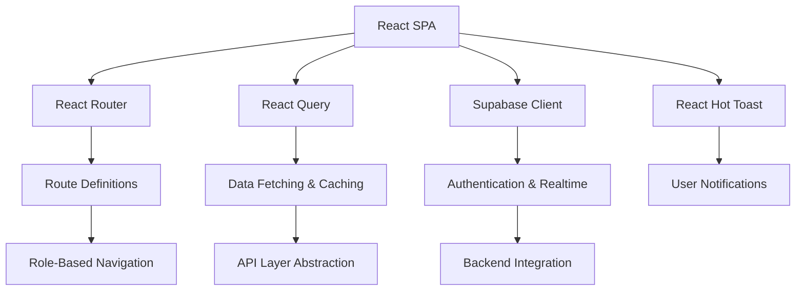
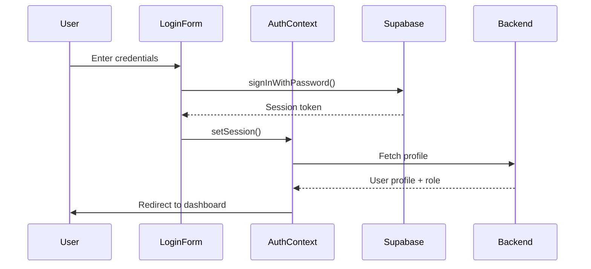
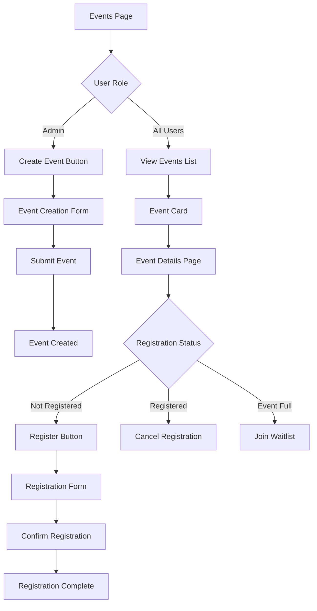
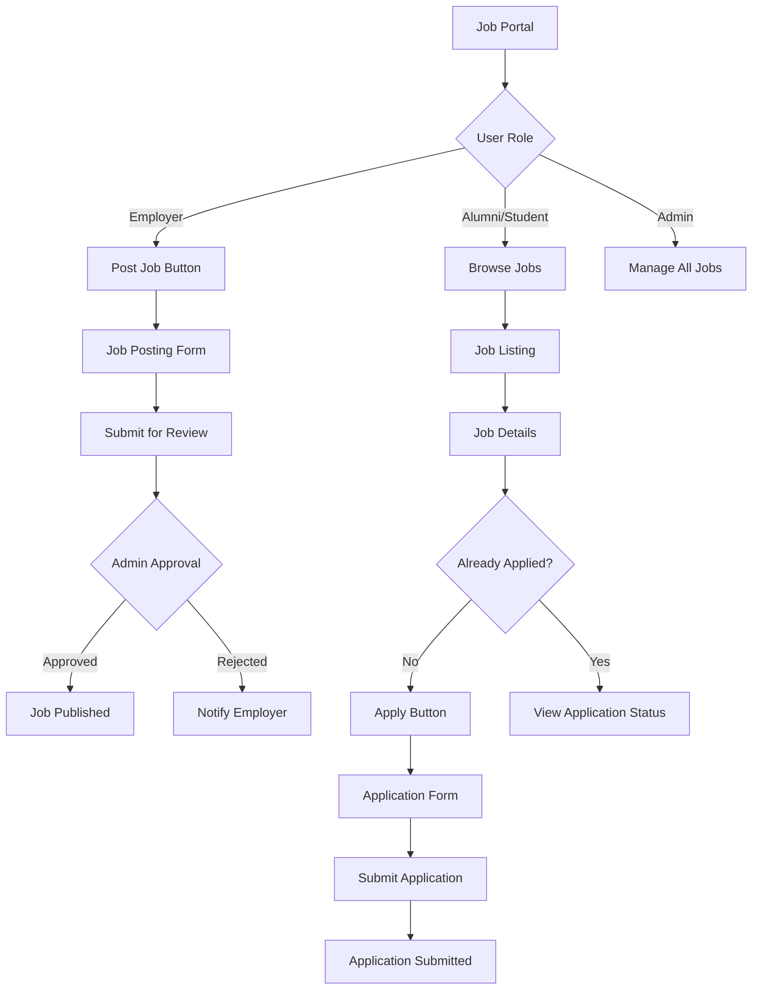
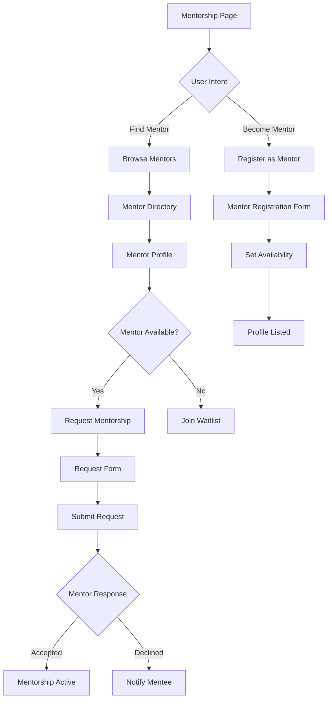
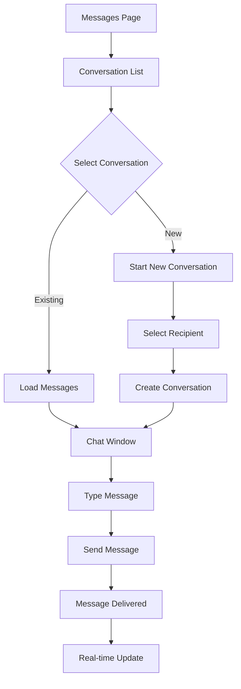

# AMET Alumni Frontend - Detailed Architecture Guide

> **🎯 Purpose**: This guide provides comprehensive explanations of each frontend section with real examples, code snippets, and visual breakdowns to help you understand the complete architecture.

---

## 📋 Table of Contents

1. [High-Level Overview](#1-high-level-overview)
2. [Entry Point & Global Layout](#2-entry-point--global-layout)
3. [Navigation & Header](#3-navigation--header-ux-shell)
4. [Routing & Major Pages](#4-routing--major-pages)
5. [Auth, Permissions & Guarding](#5-auth-permissions--guarding)
6. [Key UX Patterns & Conventions](#6-key-ux-patterns--conventions)
7. [Feature Flow Summaries](#7-feature-flow-summaries)
8. [Module Deep Dives](#8-module-deep-dives)
9. [Shared Infrastructure](#9-shared-infrastructure)
10. [Role-Based Behaviors](#10-role-based-behaviors)
11. [Security Model](#11-security-model)
12. [Development Guidelines](#12-development-guidelines)

---

## 1. High-Level Overview

### 🏗️ Architecture Overview



### 📦 Core Technologies

| Technology | Purpose | Key Files |
|------------|---------|-----------|
| **React 18** | UI Framework | `src/App.js`, all components |
| **React Router** | Client-side routing | `src/App.js` (Routes definition) |
| **React Query** | Server state management | `src/hooks/`, `src/api/` |
| **Supabase** | Backend-as-a-Service | `utils/supabase.js` |
| **Material-UI** | UI Component Library | `src/components/` |
| **React Hot Toast** | Notification system | `src/index.js`, components |

### 🎭 Role-Based Design

The app supports **5 primary roles** with different capabilities:

```javascript
// Role hierarchy (most privileged to least)
const ROLES = {
  SUPER_ADMIN: 'super_admin',  // Platform-level control
  ADMIN: 'admin',              // Tenant/Institution control
  ALUMNI: 'alumni',            // Graduate members
  STUDENT: 'student',          // Current students
  EMPLOYER: 'employer'         // Corporate partners
};
```

**Key Design Principles:**
- ✅ **Single Page Application** - No full page reloads after initial load
- ✅ **Role-gated navigation** - Menu items and routes filtered by user role
- ✅ **Progressive enhancement** - Core features work without JavaScript
- ✅ **Mobile-first responsive design** - Works on all screen sizes

---

## 2. Entry Point & Global Layout

### 🚀 Application Bootstrap (`src/index.js`)

```javascript
// Key responsibilities of index.js
1. Render React app into DOM
2. Apply React StrictMode for development
3. Configure mobile navigation provider
4. Silence console logs in production
5. Initialize error boundaries
```

**Code Structure:**
```jsx
// src/index.js
import React from 'react';
import ReactDOM from 'react-dom/client';
import App from './App';
import { MobileNavProvider } from './contexts/MobileNavContext';

// Production optimization
if (process.env.NODE_ENV === 'production') {
  console.log = () => {};
  console.warn = () => {};
  console.error = () => {};
}

const root = ReactDOM.createRoot(document.getElementById('root'));
root.render(
  <React.StrictMode>
    <MobileNavProvider>
      <App />
    </MobileNavProvider>
  </React.StrictMode>
);
```

### 🏛️ Main Application Structure (`src/App.js`)

#### Provider Stack
```jsx
// Order matters! Each provider wraps the next
<BrowserRouter>
  <QueryClientProvider>
    <AuthProvider>
      <RealtimeProvider>
        <NotificationProvider>
          <AuthListener>
            <FeedbackWidget>
              <Toaster>
                <AppContent /> {/* Main app logic */}
              </Toaster>
            </FeedbackWidget>
          </AuthListener>
        </NotificationProvider>
      </RealtimeProvider>
    </AuthProvider>
  </QueryClientProvider>
</BrowserRouter>
```

#### Layout Logic
```javascript
// AppContent determines layout based on auth state
const AppContent = () => {
  const { user, profile, loading, rejectionStatus } = useAuth();
  
  if (loading) return <LoadingSpinner />;
  if (rejectionStatus) return <RejectionPage />;
  if (!user) return <PublicRoutes />; // Login, register, etc.
  
  return <AuthenticatedLayout />; // Sidebar + header + main content
};
```

### 📱 Responsive Layout System

**Desktop Layout:**
```
┌─────────────┬─────────────────────────────────┐
│             │ Header (user menu, notifications) │
│   Sidebar   ├─────────────────────────────────┤
│  Navigation │                                 │
│             │        Main Content             │
│             │        (Routes)                 │
│             │                                 │
└─────────────┴─────────────────────────────────┘
```

**Mobile Layout:**
```
┌─────────────────────────────────┐
│ ☰  Header (user menu, notifications) │
├─────────────────────────────────┤
│                                 │
│        Main Content             │
│        (Routes)                 │
│                                 │
│                                 │
└─────────────────────────────────┘
// Sidebar slides in from left when hamburger clicked
```

---

## 3. Navigation & Header (UX Shell)

### 🧭 Navigation System (`components/Layout/Navigation.js`)

#### Role-Based Menu Logic
```javascript
const menuItems = [
  { path: '/dashboard', label: 'Dashboard', requiredPermission: 'access:dashboard' },
  { path: '/directory', label: 'Alumni Directory', requiredPermission: 'view:alumni_directory', hideFor: ['employer'] },
  { path: '/events', label: 'Events', requiredPermission: 'access:events' },
  { path: '/jobs', label: 'Job Portal', requiredPermission: 'view:jobs' },
  { path: '/mentorship', label: 'Mentorship', requiredPermission: 'request:mentorship' },
  { path: '/groups', label: 'Groups', requiredPermission: 'access:groups', hideFor: ['employer'] },
  { path: '/messages', label: 'Messages', requiredPermission: 'message:users' },
];
```

#### Active State Management
```javascript
const isActive = (path) => {
  const currentPath = location.pathname;
  return currentPath === path || currentPath.startsWith(path + '/');
};

// CSS classes applied based on state
const linkClasses = `
  flex items-center px-4 py-2 text-sm font-medium rounded-lg
  transition-colors duration-200
  ${isActive(item.path) 
    ? 'bg-primary-100 text-primary-700 border-l-4 border-primary-600' 
    : 'text-gray-600 hover:bg-gray-50 hover:text-gray-900'
  }
`;
```

### 🎨 Header Component (`components/Layout/Header.js`)

#### User Menu Structure
```jsx
// Header breaks down into 3 sections
<div className="flex items-center justify-between h-16">
  {/* Left: Mobile menu toggle */}
  <button onClick={toggleMobileNav} className="lg:hidden">
    <MenuIcon />
  </button>
  
  {/* Center: Branding */}
  <div className="flex-1 text-center">
    <h1 className="text-xl font-semibold text-gray-900">AMET Alumni</h1>
    <p className="text-sm text-gray-500">Connecting Mariners Since 1993</p>
  </div>
  
  {/* Right: User menu */}
  <DropdownMenu>
    <DropdownMenuTrigger>
      <Avatar src={user.avatar} alt={user.name} />
    </DropdownMenuTrigger>
    <DropdownMenuContent>
      <DropdownMenuItem>Profile</DropdownMenuItem>
      <DropdownMenuItem>Settings</DropdownMenuItem>
      <DropdownMenuSeparator />
      <DropdownMenuItem onClick={logout}>Sign Out</DropdownMenuItem>
    </DropdownMenuContent>
  </DropdownMenu>
</div>
```

#### Notification Bell
```jsx
// Real-time notification badge
const NotificationBell = () => {
  const { unreadCount } = useNotifications();
  
  return (
    <button className="relative p-2">
      <BellIcon className="h-6 w-6" />
      {unreadCount > 0 && (
        <span className="absolute top-0 right-0 h-5 w-5 rounded-full bg-red-500 text-white text-xs flex items-center justify-center">
          {unreadCount > 99 ? '99+' : unreadCount}
        </span>
      )}
    </button>
  );
};
```

---

## 4. Routing & Major Pages

### 🗺️ Route Architecture

#### Public Routes (No Auth Required)
```javascript
const publicRoutes = [
  { path: '/', element: <LandingPage /> },
  { path: '/login', element: <Login /> },
  { path: '/register', element: <EnhancedRegister /> },
  { path: '/forgot-password', element: <ForgotPassword /> },
  { path: '/reset-password', element: <ResetPassword /> },
  { path: '/auth/callback', element: <AuthCallback /> },
  { path: '/verify-email', element: <VerifyEmail /> },
];
```

#### Protected Routes (Auth Required)
```javascript
const protectedRoutes = [
  // Dashboard
  { path: '/dashboard', element: <AlumniDashboard />, permission: 'access:dashboard' },
  
  // Directory
  { path: '/directory', element: <AlumniDirectory />, permission: 'view:alumni_directory' },
  { path: '/profile/:id', element: <ProfileView />, permission: 'view:profiles' },
  
  // Events
  { path: '/events', element: <EventsPage />, permission: 'access:events' },
  { path: '/events/:id', element: <EventDetails />, permission: 'view:event_details' },
  { path: '/events/create', element: <CreateEvent />, permission: 'create:events' },
  
  // Jobs
  { path: '/jobs', element: <JobPortal />, permission: 'view:jobs' },
  { path: '/jobs/:id', element: <JobDetails />, permission: 'view:job_details' },
  { path: '/jobs/post', element: <PostJob />, permission: 'post:jobs' },
  
  // Mentorship
  { path: '/mentorship', element: <Mentorship />, permission: 'request:mentorship' },
  { path: '/mentorship/:id', element: <MentorshipDetails />, permission: 'view:mentorship' },
  
  // Groups
  { path: '/groups', element: <GroupsPage />, permission: 'access:groups' },
  { path: '/groups/:id', element: <GroupDetails />, permission: 'view:group_details' },
  
  // Messaging
  { path: '/messages', element: <MessagingSystem />, permission: 'message:users' },
  { path: '/messages/:conversationId', element: <MessagingSystem />, permission: 'message:users' },
  
  // Profile & Settings
  { path: '/profile', element: <ProfileSettings />, permission: 'edit:own_profile' },
  { path: '/settings', element: <Settings />, permission: 'access:settings' },
  
  // Admin Routes
  { path: '/admin/*', element: <AdminRoutes />, permission: 'access:admin_panel' },
];
```

### 🔐 Route Guards

#### ProtectedRoute Component
```jsx
const ProtectedRoute = ({ children, permission }) => {
  const { user, loading } = useAuth();
  const { hasPermission } = usePermissions();
  
  if (loading) return <LoadingSpinner />;
  if (!user) return <Navigate to="/login" replace />;
  if (permission && !hasPermission(permission)) {
    return <Navigate to="/unauthorized" replace />;
  }
  
  return children;
};
```

#### Usage in Routes
```jsx
<Route 
  path="/admin/users" 
  element={
    <ProtectedRoute permission="manage:users">
      <UserManagement />
    </ProtectedRoute>
  } 
/>
```

---

## 5. Auth, Permissions & Guarding

### 🔑 Authentication Flow

#### Login Process


#### AuthContext Structure
```javascript
const AuthContext = createContext({
  user: null,           // Supabase auth user
  profile: null,        // Extended profile from profiles table
  role: null,           // User's role (admin, alumni, etc.)
  loading: true,        // Auth state loading
  login: async () => {},
  logout: async () => {},
  updateProfile: async () => {},
});

// Provider implementation
const AuthProvider = ({ children }) => {
  const [user, setUser] = useState(null);
  const [profile, setProfile] = useState(null);
  const [loading, setLoading] = useState(true);
  
  useEffect(() => {
    // Listen for auth state changes
    const { data: { subscription } } = supabase.auth.onAuthStateChange(
      async (event, session) => {
        if (session?.user) {
          setUser(session.user);
          await fetchProfile(session.user.id);
        } else {
          setUser(null);
          setProfile(null);
        }
        setLoading(false);
      }
    );
    
    return () => subscription.unsubscribe();
  }, []);
  
  // ... rest of implementation
};
```

### 🛡️ Permission System

#### Permission Definitions
```javascript
// constants/permissions.js
export const PERMISSIONS = {
  // Dashboard
  'access:dashboard': ['super_admin', 'admin', 'alumni', 'student', 'employer'],
  
  // Directory
  'view:alumni_directory': ['super_admin', 'admin', 'alumni', 'student'],
  'view:profiles': ['super_admin', 'admin', 'alumni', 'student', 'employer'],
  
  // Events
  'access:events': ['super_admin', 'admin', 'alumni', 'student', 'employer'],
  'create:events': ['super_admin', 'admin'],
  'edit:events': ['super_admin', 'admin'],
  'delete:events': ['super_admin', 'admin'],
  
  // Jobs
  'view:jobs': ['super_admin', 'admin', 'alumni', 'student', 'employer'],
  'post:jobs': ['super_admin', 'admin', 'employer'],
  'apply:jobs': ['alumni', 'student'],
  
  // Mentorship
  'request:mentorship': ['alumni', 'student'],
  'offer:mentorship': ['alumni'],
  'manage:mentorship': ['super_admin', 'admin'],
  
  // Groups
  'access:groups': ['super_admin', 'admin', 'alumni', 'student'],
  'create:groups': ['super_admin', 'admin', 'alumni'],
  
  // Messaging
  'message:users': ['super_admin', 'admin', 'alumni', 'student', 'employer'],
  
  // Admin
  'access:admin_panel': ['super_admin', 'admin'],
  'manage:users': ['super_admin', 'admin'],
  'manage:roles': ['super_admin'],
};
```

#### usePermissions Hook
```javascript
const usePermissions = () => {
  const { profile } = useAuth();
  
  const hasPermission = useCallback((permission) => {
    if (!profile?.role) return false;
    const allowedRoles = PERMISSIONS[permission] || [];
    return allowedRoles.includes(profile.role);
  }, [profile?.role]);
  
  const hasAnyPermission = useCallback((permissions) => {
    return permissions.some(p => hasPermission(p));
  }, [hasPermission]);
  
  const hasAllPermissions = useCallback((permissions) => {
    return permissions.every(p => hasPermission(p));
  }, [hasPermission]);
  
  return { hasPermission, hasAnyPermission, hasAllPermissions };
};
```

### 🚧 Route Protection Patterns

#### RequireAuth Wrapper
```jsx
const RequireAuth = ({ children, fallback = <Navigate to="/login" /> }) => {
  const { user, loading } = useAuth();
  
  if (loading) return <LoadingSpinner />;
  if (!user) return fallback;
  
  return children;
};
```

#### RequireRole Wrapper
```jsx
const RequireRole = ({ children, roles, fallback = <Unauthorized /> }) => {
  const { profile } = useAuth();
  
  if (!roles.includes(profile?.role)) return fallback;
  
  return children;
};

// Usage
<RequireRole roles={['admin', 'super_admin']}>
  <AdminPanel />
</RequireRole>
```

---

## 6. Key UX Patterns & Conventions

### 🎨 Design System

#### Color Palette
```css
/* Primary colors */
--primary-50: #eff6ff;
--primary-100: #dbeafe;
--primary-500: #3b82f6;
--primary-600: #2563eb;
--primary-700: #1d4ed8;

/* Status colors */
--success: #10b981;
--warning: #f59e0b;
--error: #ef4444;
--info: #3b82f6;

/* Neutral colors */
--gray-50: #f9fafb;
--gray-100: #f3f4f6;
--gray-500: #6b7280;
--gray-900: #111827;
```

#### Typography Scale
```css
/* Headings */
.text-h1 { font-size: 2.25rem; font-weight: 700; }
.text-h2 { font-size: 1.875rem; font-weight: 600; }
.text-h3 { font-size: 1.5rem; font-weight: 600; }
.text-h4 { font-size: 1.25rem; font-weight: 500; }

/* Body text */
.text-body { font-size: 1rem; line-height: 1.5; }
.text-small { font-size: 0.875rem; line-height: 1.4; }
.text-xs { font-size: 0.75rem; line-height: 1.3; }
```

### 📝 Form Patterns

#### Standard Form Structure
```jsx
const FormExample = () => {
  const [formData, setFormData] = useState({ name: '', email: '' });
  const [errors, setErrors] = useState({});
  const [isSubmitting, setIsSubmitting] = useState(false);
  
  const handleSubmit = async (e) => {
    e.preventDefault();
    setIsSubmitting(true);
    
    try {
      const validationErrors = validate(formData);
      if (Object.keys(validationErrors).length > 0) {
        setErrors(validationErrors);
        return;
      }
      
      await submitForm(formData);
      toast.success('Form submitted successfully!');
    } catch (error) {
      toast.error('Failed to submit form');
    } finally {
      setIsSubmitting(false);
    }
  };
  
  return (
    <form onSubmit={handleSubmit}>
      <FormField
        label="Name"
        name="name"
        value={formData.name}
        onChange={(e) => setFormData({ ...formData, name: e.target.value })}
        error={errors.name}
        required
      />
      <FormField
        label="Email"
        name="email"
        type="email"
        value={formData.email}
        onChange={(e) => setFormData({ ...formData, email: e.target.value })}
        error={errors.email}
        required
      />
      <Button type="submit" loading={isSubmitting}>
        Submit
      </Button>
    </form>
  );
};
```

### 🔄 Loading States

#### Skeleton Loading
```jsx
const CardSkeleton = () => (
  <div className="animate-pulse">
    <div className="h-48 bg-gray-200 rounded-t-lg" />
    <div className="p-4 space-y-3">
      <div className="h-4 bg-gray-200 rounded w-3/4" />
      <div className="h-4 bg-gray-200 rounded w-1/2" />
      <div className="h-4 bg-gray-200 rounded w-5/6" />
    </div>
  </div>
);

// Usage in list
const EventsList = () => {
  const { data: events, isLoading } = useEvents();
  
  if (isLoading) {
    return (
      <div className="grid grid-cols-3 gap-4">
        {[1, 2, 3, 4, 5, 6].map(i => <CardSkeleton key={i} />)}
      </div>
    );
  }
  
  return (
    <div className="grid grid-cols-3 gap-4">
      {events.map(event => <EventCard key={event.id} event={event} />)}
    </div>
  );
};
```

### ❌ Error Handling

#### Error Boundary
```jsx
class ErrorBoundary extends React.Component {
  state = { hasError: false, error: null };
  
  static getDerivedStateFromError(error) {
    return { hasError: true, error };
  }
  
  componentDidCatch(error, errorInfo) {
    console.error('Error caught by boundary:', error, errorInfo);
    // Log to error tracking service
  }
  
  render() {
    if (this.state.hasError) {
      return (
        <div className="flex flex-col items-center justify-center min-h-screen">
          <h1 className="text-2xl font-bold text-gray-900">Something went wrong</h1>
          <p className="text-gray-600 mt-2">Please try refreshing the page</p>
          <Button onClick={() => window.location.reload()} className="mt-4">
            Refresh Page
          </Button>
        </div>
      );
    }
    
    return this.props.children;
  }
}
```

#### API Error Handling
```javascript
const handleApiError = (error) => {
  if (error.code === 'PGRST116') {
    toast.error('Resource not found');
  } else if (error.code === '42501') {
    toast.error('You do not have permission to perform this action');
  } else if (error.message?.includes('JWT')) {
    toast.error('Session expired. Please log in again.');
    // Redirect to login
  } else {
    toast.error(error.message || 'An unexpected error occurred');
  }
};
```

### 🔔 Toast Notifications

#### Toast Configuration
```javascript
// Toaster setup in App.js
<Toaster
  position="top-right"
  toastOptions={{
    duration: 4000,
    style: {
      background: '#363636',
      color: '#fff',
    },
    success: {
      duration: 3000,
      iconTheme: { primary: '#10b981', secondary: '#fff' },
    },
    error: {
      duration: 5000,
      iconTheme: { primary: '#ef4444', secondary: '#fff' },
    },
  }}
/>
```

#### Toast Usage Patterns
```javascript
// Success
toast.success('Profile updated successfully!');

// Error
toast.error('Failed to save changes');

// Loading with promise
toast.promise(
  saveData(),
  {
    loading: 'Saving...',
    success: 'Saved successfully!',
    error: 'Failed to save',
  }
);

// Custom toast
toast.custom((t) => (
  <div className={`${t.visible ? 'animate-enter' : 'animate-leave'} bg-white shadow-lg rounded-lg p-4`}>
    <p>Custom notification content</p>
    <button onClick={() => toast.dismiss(t.id)}>Dismiss</button>
  </div>
));
```

---

## 7. Feature Flow Summaries

### 📅 Events Module Flow



#### Event States
```javascript
const EVENT_STATES = {
  DRAFT: 'draft',           // Not published
  PUBLISHED: 'published',   // Open for registration
  REGISTRATION_CLOSED: 'registration_closed',
  IN_PROGRESS: 'in_progress',
  COMPLETED: 'completed',
  CANCELLED: 'cancelled',
};
```

### 💼 Jobs Module Flow



#### Job Application States
```javascript
const APPLICATION_STATES = {
  SUBMITTED: 'submitted',
  UNDER_REVIEW: 'under_review',
  SHORTLISTED: 'shortlisted',
  INTERVIEW_SCHEDULED: 'interview_scheduled',
  OFFERED: 'offered',
  REJECTED: 'rejected',
  WITHDRAWN: 'withdrawn',
};
```

### 🤝 Mentorship Module Flow



### 💬 Messaging Module Flow



---

## 8. Module Deep Dives

### 📁 Directory Module (`components/Directory/`)

#### Component Structure
```
Directory/
├── AlumniDirectory.js      # Main container
├── DirectoryFilters.js     # Filter sidebar
├── DirectoryCard.js        # Individual alumni card
├── DirectorySearch.js      # Search input
└── DirectoryPagination.js  # Pagination controls
```

#### AlumniDirectory Component
```jsx
const AlumniDirectory = () => {
  const [filters, setFilters] = useState({
    search: '',
    graduationYear: null,
    department: null,
    location: null,
    industry: null,
  });
  const [page, setPage] = useState(1);
  const pageSize = 12;
  
  const { data, isLoading, error } = useQuery(
    ['alumni', filters, page],
    () => fetchAlumni({ ...filters, page, pageSize }),
    { keepPreviousData: true }
  );
  
  return (
    <div className="flex gap-6">
      {/* Filters Sidebar */}
      <aside className="w-64 flex-shrink-0">
        <DirectoryFilters filters={filters} onChange={setFilters} />
      </aside>
      
      {/* Main Content */}
      <main className="flex-1">
        <DirectorySearch 
          value={filters.search} 
          onChange={(search) => setFilters({ ...filters, search })} 
        />
        
        {isLoading ? (
          <DirectorySkeleton />
        ) : error ? (
          <ErrorState error={error} />
        ) : (
          <>
            <div className="grid grid-cols-3 gap-4">
              {data.alumni.map(alumni => (
                <DirectoryCard key={alumni.id} alumni={alumni} />
              ))}
            </div>
            <DirectoryPagination
              currentPage={page}
              totalPages={data.totalPages}
              onPageChange={setPage}
            />
          </>
        )}
      </main>
    </div>
  );
};
```

#### DirectoryCard Component
```jsx
const DirectoryCard = ({ alumni }) => {
  const navigate = useNavigate();
  
  return (
    <div 
      className="bg-white rounded-lg shadow-sm border border-gray-200 p-4 hover:shadow-md transition-shadow cursor-pointer"
      onClick={() => navigate(`/profile/${alumni.id}`)}
    >
      {/* Avatar */}
      <div className="flex items-center gap-3 mb-3">
        <Avatar 
          src={alumni.avatar_url} 
          alt={alumni.full_name}
          fallback={alumni.full_name?.charAt(0)}
          className="h-12 w-12"
        />
        <div>
          <h3 className="font-semibold text-gray-900">{alumni.full_name}</h3>
          <p className="text-sm text-gray-500">{alumni.current_job_title}</p>
        </div>
      </div>
      
      {/* Info Chips */}
      <div className="flex flex-wrap gap-2">
        <Chip icon={<GraduationCap />} label={alumni.graduation_year} />
        <Chip icon={<Building />} label={alumni.company_name} />
        <Chip icon={<MapPin />} label={alumni.location} />
      </div>
      
      {/* Actions */}
      <div className="flex gap-2 mt-4">
        <Button variant="outline" size="sm" onClick={(e) => {
          e.stopPropagation();
          // Start conversation
        }}>
          Message
        </Button>
        <Button variant="outline" size="sm" onClick={(e) => {
          e.stopPropagation();
          // Send connection request
        }}>
          Connect
        </Button>
      </div>
    </div>
  );
};
```

### 📅 Events Module (`components/Events/`)

#### Component Structure
```
Events/
├── EventsPage.js           # Main container with tabs
├── EventsList.js           # List view
├── EventCard.js            # Event card component
├── EventDetails.js         # Single event page
├── EventRegistration.js    # Registration form
├── CreateEvent.js          # Event creation (admin)
├── EditEvent.js            # Event editing (admin)
└── MyEvents.js             # User's registered events
```

#### EventsPage with Tabs
```jsx
const EventsPage = () => {
  const [activeTab, setActiveTab] = useState('upcoming');
  const { hasPermission } = usePermissions();
  
  return (
    <div className="container mx-auto px-4 py-6">
      {/* Header */}
      <div className="flex justify-between items-center mb-6">
        <h1 className="text-2xl font-bold">Events</h1>
        {hasPermission('create:events') && (
          <Button onClick={() => navigate('/events/create')}>
            <Plus className="h-4 w-4 mr-2" />
            Create Event
          </Button>
        )}
      </div>
      
      {/* Tabs */}
      <Tabs value={activeTab} onValueChange={setActiveTab}>
        <TabsList>
          <TabsTrigger value="upcoming">Upcoming</TabsTrigger>
          <TabsTrigger value="past">Past Events</TabsTrigger>
          <TabsTrigger value="my-events">My Events</TabsTrigger>
        </TabsList>
        
        <TabsContent value="upcoming">
          <EventsList filter="upcoming" />
        </TabsContent>
        <TabsContent value="past">
          <EventsList filter="past" />
        </TabsContent>
        <TabsContent value="my-events">
          <MyEvents />
        </TabsContent>
      </Tabs>
    </div>
  );
};
```

### 💼 Jobs Module (`components/Jobs/`)

#### Component Structure
```
Jobs/
├── JobPortal.js            # Main container
├── JobsList.js             # Job listings
├── JobCard.js              # Job card component
├── JobDetails.js           # Single job page
├── JobApplication.js       # Application form
├── PostJob.js              # Job posting (employer)
├── MyApplications.js       # User's applications
└── ManageJobs.js           # Admin job management
```

#### JobPortal Component
```jsx
const JobPortal = () => {
  const { profile } = useAuth();
  const [filters, setFilters] = useState({
    search: '',
    type: null,      // full-time, part-time, contract
    location: null,
    remote: null,
    salary_min: null,
    salary_max: null,
  });
  
  return (
    <div className="container mx-auto px-4 py-6">
      {/* Header with role-specific actions */}
      <div className="flex justify-between items-center mb-6">
        <h1 className="text-2xl font-bold">Job Portal</h1>
        {profile?.role === 'employer' && (
          <Button onClick={() => navigate('/jobs/post')}>
            <Plus className="h-4 w-4 mr-2" />
            Post a Job
          </Button>
        )}
      </div>
      
      {/* Search and Filters */}
      <div className="bg-white rounded-lg shadow-sm p-4 mb-6">
        <JobFilters filters={filters} onChange={setFilters} />
      </div>
      
      {/* Job Listings */}
      <JobsList filters={filters} />
    </div>
  );
};
```

### 🤝 Mentorship Module (`components/Mentorship/`)

#### Component Structure
```
Mentorship/
├── Mentorship.js           # Main container
├── MentorDirectory.js      # Browse mentors
├── MentorCard.js           # Mentor card
├── MentorProfile.js        # Detailed mentor view
├── MentorshipRequest.js    # Request form
├── MyMentorships.js        # Active mentorships
├── MentorDashboard.js      # Mentor's view
└── MentorshipChat.js       # Communication
```

#### Mentorship Main Component
```jsx
const Mentorship = () => {
  const { profile } = useAuth();
  const [view, setView] = useState('find'); // 'find' | 'my-mentorships' | 'mentor-dashboard'
  
  const isMentor = profile?.is_mentor;
  
  return (
    <div className="container mx-auto px-4 py-6">
      {/* Navigation Tabs */}
      <Tabs value={view} onValueChange={setView}>
        <TabsList>
          <TabsTrigger value="find">Find a Mentor</TabsTrigger>
          <TabsTrigger value="my-mentorships">My Mentorships</TabsTrigger>
          {isMentor && (
            <TabsTrigger value="mentor-dashboard">Mentor Dashboard</TabsTrigger>
          )}
        </TabsList>
        
        <TabsContent value="find">
          <MentorDirectory />
        </TabsContent>
        <TabsContent value="my-mentorships">
          <MyMentorships />
        </TabsContent>
        {isMentor && (
          <TabsContent value="mentor-dashboard">
            <MentorDashboard />
          </TabsContent>
        )}
      </Tabs>
      
      {/* Become a Mentor CTA */}
      {!isMentor && profile?.role === 'alumni' && (
        <Card className="mt-6 bg-primary-50 border-primary-200">
          <CardContent className="flex items-center justify-between p-6">
            <div>
              <h3 className="font-semibold text-primary-900">Become a Mentor</h3>
              <p className="text-primary-700">Share your experience and help fellow alumni grow</p>
            </div>
            <Button onClick={() => navigate('/mentorship/register')}>
              Register as Mentor
            </Button>
          </CardContent>
        </Card>
      )}
    </div>
  );
};
```

### 💬 Messaging Module (`components/Messaging/`)

#### Component Structure
```
Messaging/
├── MessagingSystem.js      # Main container
├── ConversationList.js     # Sidebar with conversations
├── ConversationItem.js     # Single conversation preview
├── ChatWindow.js           # Active chat
├── MessageBubble.js        # Individual message
├── MessageInput.js         # Compose message
└── NewConversation.js      # Start new chat
```

#### MessagingSystem Component
```jsx
const MessagingSystem = () => {
  const { conversationId } = useParams();
  const [selectedConversation, setSelectedConversation] = useState(conversationId);
  
  return (
    <div className="flex h-[calc(100vh-4rem)]">
      {/* Conversation List Sidebar */}
      <aside className="w-80 border-r border-gray-200 flex flex-col">
        <div className="p-4 border-b border-gray-200">
          <Button 
            className="w-full" 
            onClick={() => setSelectedConversation('new')}
          >
            <Plus className="h-4 w-4 mr-2" />
            New Message
          </Button>
        </div>
        <ConversationList 
          selectedId={selectedConversation}
          onSelect={setSelectedConversation}
        />
      </aside>
      
      {/* Chat Area */}
      <main className="flex-1 flex flex-col">
        {selectedConversation === 'new' ? (
          <NewConversation onCreated={setSelectedConversation} />
        ) : selectedConversation ? (
          <ChatWindow conversationId={selectedConversation} />
        ) : (
          <EmptyState message="Select a conversation to start messaging" />
        )}
      </main>
    </div>
  );
};
```

#### ChatWindow with Real-time Updates
```jsx
const ChatWindow = ({ conversationId }) => {
  const { user } = useAuth();
  const messagesEndRef = useRef(null);
  
  // Fetch messages
  const { data: messages, isLoading } = useQuery(
    ['messages', conversationId],
    () => fetchMessages(conversationId)
  );
  
  // Real-time subscription
  useEffect(() => {
    const subscription = supabase
      .channel(`messages:${conversationId}`)
      .on('postgres_changes', {
        event: 'INSERT',
        schema: 'public',
        table: 'messages',
        filter: `conversation_id=eq.${conversationId}`,
      }, (payload) => {
        queryClient.setQueryData(['messages', conversationId], (old) => [
          ...old,
          payload.new,
        ]);
      })
      .subscribe();
    
    return () => subscription.unsubscribe();
  }, [conversationId]);
  
  // Auto-scroll to bottom
  useEffect(() => {
    messagesEndRef.current?.scrollIntoView({ behavior: 'smooth' });
  }, [messages]);
  
  return (
    <div className="flex flex-col h-full">
      {/* Header */}
      <ConversationHeader conversationId={conversationId} />
      
      {/* Messages */}
      <div className="flex-1 overflow-y-auto p-4 space-y-4">
        {messages?.map(message => (
          <MessageBubble 
            key={message.id}
            message={message}
            isOwn={message.sender_id === user.id}
          />
        ))}
        <div ref={messagesEndRef} />
      </div>
      
      {/* Input */}
      <MessageInput conversationId={conversationId} />
    </div>
  );
};
```

### 👥 Groups Module (`components/Groups/`)

#### Component Structure
```
Groups/
├── GroupsPage.js           # Main container
├── GroupsList.js           # Browse groups
├── GroupCard.js            # Group preview card
├── GroupDetails.js         # Single group page
├── GroupMembers.js         # Member list
├── GroupDiscussions.js     # Group posts/discussions
├── CreateGroup.js          # Create new group
└── ManageGroup.js          # Group admin settings
```

---

## 9. Shared Infrastructure

### 🔧 API Layer (`src/api/`)

#### API Structure
```
api/
├── index.js                # API client setup
├── auth.js                 # Authentication APIs
├── profiles.js             # Profile APIs
├── events.js               # Events APIs
├── jobs.js                 # Jobs APIs
├── mentorship.js           # Mentorship APIs
├── messages.js             # Messaging APIs
└── groups.js               # Groups APIs
```

#### API Client Setup
```javascript
// api/index.js
import { supabase } from '../utils/supabase';

export const apiClient = {
  async get(table, options = {}) {
    let query = supabase.from(table).select(options.select || '*');
    
    if (options.filters) {
      Object.entries(options.filters).forEach(([key, value]) => {
        if (value !== null && value !== undefined) {
          query = query.eq(key, value);
        }
      });
    }
    
    if (options.order) {
      query = query.order(options.order.column, { ascending: options.order.ascending });
    }
    
    if (options.limit) {
      query = query.limit(options.limit);
    }
    
    if (options.range) {
      query = query.range(options.range.from, options.range.to);
    }
    
    const { data, error, count } = await query;
    if (error) throw error;
    return { data, count };
  },
  
  async getById(table, id, select = '*') {
    const { data, error } = await supabase
      .from(table)
      .select(select)
      .eq('id', id)
      .single();
    if (error) throw error;
    return data;
  },
  
  async create(table, data) {
    const { data: result, error } = await supabase
      .from(table)
      .insert(data)
      .select()
      .single();
    if (error) throw error;
    return result;
  },
  
  async update(table, id, data) {
    const { data: result, error } = await supabase
      .from(table)
      .update(data)
      .eq('id', id)
      .select()
      .single();
    if (error) throw error;
    return result;
  },
  
  async delete(table, id) {
    const { error } = await supabase
      .from(table)
      .delete()
      .eq('id', id);
    if (error) throw error;
  },
};
```

#### Example API Module
```javascript
// api/events.js
import { apiClient } from './index';
import { supabase } from '../utils/supabase';

export const eventsApi = {
  async getAll(filters = {}) {
    return apiClient.get('events', {
      select: `
        *,
        organizer:profiles!organizer_id(id, full_name, avatar_url),
        registrations:event_registrations(count)
      `,
      filters: {
        status: filters.status,
        event_type: filters.type,
      },
      order: { column: 'start_date', ascending: true },
    });
  },
  
  async getById(id) {
    return apiClient.getById('events', id, `
      *,
      organizer:profiles!organizer_id(id, full_name, avatar_url, current_job_title),
      registrations:event_registrations(
        id,
        user:profiles(id, full_name, avatar_url)
      )
    `);
  },
  
  async create(eventData) {
    return apiClient.create('events', eventData);
  },
  
  async update(id, eventData) {
    return apiClient.update('events', id, eventData);
  },
  
  async register(eventId, userId) {
    return apiClient.create('event_registrations', {
      event_id: eventId,
      user_id: userId,
      status: 'registered',
    });
  },
  
  async cancelRegistration(eventId, userId) {
    const { error } = await supabase
      .from('event_registrations')
      .delete()
      .match({ event_id: eventId, user_id: userId });
    if (error) throw error;
  },
};
```

### 🪝 Custom Hooks (`src/hooks/`)

#### Hooks Structure
```
hooks/
├── useAuth.js              # Authentication hook
├── usePermissions.js       # Permission checking
├── useProfile.js           # Profile data
├── useEvents.js            # Events data
├── useJobs.js              # Jobs data
├── useMentorship.js        # Mentorship data
├── useMessages.js          # Messaging data
├── useGroups.js            # Groups data
├── useNotifications.js     # Notifications
├── useRealtime.js          # Real-time subscriptions
└── useDebounce.js          # Utility hooks
```

#### useEvents Hook Example
```javascript
// hooks/useEvents.js
import { useQuery, useMutation, useQueryClient } from '@tanstack/react-query';
import { eventsApi } from '../api/events';
import toast from 'react-hot-toast';

export const useEvents = (filters = {}) => {
  return useQuery({
    queryKey: ['events', filters],
    queryFn: () => eventsApi.getAll(filters),
    staleTime: 5 * 60 * 1000, // 5 minutes
  });
};

export const useEvent = (id) => {
  return useQuery({
    queryKey: ['event', id],
    queryFn: () => eventsApi.getById(id),
    enabled: !!id,
  });
};

export const useCreateEvent = () => {
  const queryClient = useQueryClient();
  
  return useMutation({
    mutationFn: eventsApi.create,
    onSuccess: () => {
      queryClient.invalidateQueries(['events']);
      toast.success('Event created successfully!');
    },
    onError: (error) => {
      toast.error(error.message || 'Failed to create event');
    },
  });
};

export const useRegisterForEvent = () => {
  const queryClient = useQueryClient();
  
  return useMutation({
    mutationFn: ({ eventId, userId }) => eventsApi.register(eventId, userId),
    onSuccess: (_, { eventId }) => {
      queryClient.invalidateQueries(['event', eventId]);
      queryClient.invalidateQueries(['events']);
      toast.success('Successfully registered for event!');
    },
    onError: (error) => {
      toast.error(error.message || 'Failed to register');
    },
  });
};
```

### 🛠️ Utilities (`src/utils/`)

#### Utilities Structure
```
utils/
├── supabase.js             # Supabase client
├── formatters.js           # Data formatting
├── validators.js           # Form validation
├── helpers.js              # General helpers
├── constants.js            # App constants
└── storage.js              # Local storage helpers
```

#### Supabase Client
```javascript
// utils/supabase.js
import { createClient } from '@supabase/supabase-js';

const supabaseUrl = process.env.REACT_APP_SUPABASE_URL;
const supabaseAnonKey = process.env.REACT_APP_SUPABASE_ANON_KEY;

export const supabase = createClient(supabaseUrl, supabaseAnonKey, {
  auth: {
    autoRefreshToken: true,
    persistSession: true,
    detectSessionInUrl: true,
  },
  realtime: {
    params: {
      eventsPerSecond: 10,
    },
  },
});

// Auth helpers
export const signIn = async (email, password) => {
  const { data, error } = await supabase.auth.signInWithPassword({
    email,
    password,
  });
  if (error) throw error;
  return data;
};

export const signUp = async (email, password, metadata = {}) => {
  const { data, error } = await supabase.auth.signUp({
    email,
    password,
    options: {
      data: metadata,
    },
  });
  if (error) throw error;
  return data;
};

export const signOut = async () => {
  const { error } = await supabase.auth.signOut();
  if (error) throw error;
};

export const getCurrentUser = async () => {
  const { data: { user }, error } = await supabase.auth.getUser();
  if (error) throw error;
  return user;
};
```

#### Formatters
```javascript
// utils/formatters.js
export const formatDate = (date, options = {}) => {
  const defaultOptions = {
    year: 'numeric',
    month: 'short',
    day: 'numeric',
  };
  return new Date(date).toLocaleDateString('en-US', { ...defaultOptions, ...options });
};

export const formatDateTime = (date) => {
  return new Date(date).toLocaleString('en-US', {
    year: 'numeric',
    month: 'short',
    day: 'numeric',
    hour: '2-digit',
    minute: '2-digit',
  });
};

export const formatRelativeTime = (date) => {
  const now = new Date();
  const then = new Date(date);
  const diffMs = now - then;
  const diffMins = Math.floor(diffMs / 60000);
  const diffHours = Math.floor(diffMs / 3600000);
  const diffDays = Math.floor(diffMs / 86400000);
  
  if (diffMins < 1) return 'Just now';
  if (diffMins < 60) return `${diffMins}m ago`;
  if (diffHours < 24) return `${diffHours}h ago`;
  if (diffDays < 7) return `${diffDays}d ago`;
  return formatDate(date);
};

export const formatCurrency = (amount, currency = 'USD') => {
  return new Intl.NumberFormat('en-US', {
    style: 'currency',
    currency,
  }).format(amount);
};

export const truncateText = (text, maxLength = 100) => {
  if (!text || text.length <= maxLength) return text;
  return text.substring(0, maxLength).trim() + '...';
};
```

#### Validators
```javascript
// utils/validators.js
export const validators = {
  required: (value) => {
    if (!value || (typeof value === 'string' && !value.trim())) {
      return 'This field is required';
    }
    return null;
  },
  
  email: (value) => {
    const emailRegex = /^[^\s@]+@[^\s@]+\.[^\s@]+$/;
    if (!emailRegex.test(value)) {
      return 'Please enter a valid email address';
    }
    return null;
  },
  
  minLength: (min) => (value) => {
    if (value && value.length < min) {
      return `Must be at least ${min} characters`;
    }
    return null;
  },
  
  maxLength: (max) => (value) => {
    if (value && value.length > max) {
      return `Must be no more than ${max} characters`;
    }
    return null;
  },
  
  phone: (value) => {
    const phoneRegex = /^\+?[\d\s-()]{10,}$/;
    if (value && !phoneRegex.test(value)) {
      return 'Please enter a valid phone number';
    }
    return null;
  },
  
  url: (value) => {
    try {
      if (value) new URL(value);
      return null;
    } catch {
      return 'Please enter a valid URL';
    }
  },
};

export const validate = (value, rules) => {
  for (const rule of rules) {
    const error = rule(value);
    if (error) return error;
  }
  return null;
};

export const validateForm = (formData, validationRules) => {
  const errors = {};
  
  Object.entries(validationRules).forEach(([field, rules]) => {
    const error = validate(formData[field], rules);
    if (error) errors[field] = error;
  });
  
  return errors;
};
```

---

## 10. Role-Based Behaviors

### 👤 Role Definitions

```javascript
// constants/roles.js
export const ROLES = {
  SUPER_ADMIN: 'super_admin',
  ADMIN: 'admin',
  ALUMNI: 'alumni',
  STUDENT: 'student',
  EMPLOYER: 'employer',
};

export const ROLE_LABELS = {
  [ROLES.SUPER_ADMIN]: 'Super Administrator',
  [ROLES.ADMIN]: 'Administrator',
  [ROLES.ALUMNI]: 'Alumni',
  [ROLES.STUDENT]: 'Student',
  [ROLES.EMPLOYER]: 'Employer',
};

export const ROLE_HIERARCHY = [
  ROLES.SUPER_ADMIN,
  ROLES.ADMIN,
  ROLES.ALUMNI,
  ROLES.STUDENT,
  ROLES.EMPLOYER,
];
```

### 🎯 Role-Specific Features

#### Super Admin
```javascript
const SUPER_ADMIN_FEATURES = {
  // Full system access
  canManageAllUsers: true,
  canManageRoles: true,
  canViewAnalytics: true,
  canManageSettings: true,
  canImpersonateUsers: true,
  canAccessAuditLogs: true,
  
  // Content management
  canApproveContent: true,
  canDeleteAnyContent: true,
  canFeatureContent: true,
  
  // Navigation items
  navItems: [
    '/dashboard',
    '/directory',
    '/events',
    '/jobs',
    '/mentorship',
    '/groups',
    '/messages',
    '/admin',
    '/admin/users',
    '/admin/analytics',
    '/admin/settings',
  ],
};
```

#### Admin
```javascript
const ADMIN_FEATURES = {
  // User management (limited)
  canManageUsers: true,
  canApproveUsers: true,
  canViewReports: true,
  
  // Content management
  canCreateEvents: true,
  canEditEvents: true,
  canApproveJobs: true,
  canManageGroups: true,
  
  // Navigation items
  navItems: [
    '/dashboard',
    '/directory',
    '/events',
    '/jobs',
    '/mentorship',
    '/groups',
    '/messages',
    '/admin',
    '/admin/users',
    '/admin/content',
  ],
};
```

#### Alumni
```javascript
const ALUMNI_FEATURES = {
  // Profile
  canEditOwnProfile: true,
  canSetMentorStatus: true,
  
  // Networking
  canViewDirectory: true,
  canSendMessages: true,
  canJoinGroups: true,
  canCreateGroups: true,
  
  // Events
  canViewEvents: true,
  canRegisterForEvents: true,
  
  // Jobs
  canViewJobs: true,
  canApplyForJobs: true,
  
  // Mentorship
  canRequestMentorship: true,
  canOfferMentorship: true,
  
  // Navigation items
  navItems: [
    '/dashboard',
    '/directory',
    '/events',
    '/jobs',
    '/mentorship',
    '/groups',
    '/messages',
    '/profile',
  ],
};
```

#### Student
```javascript
const STUDENT_FEATURES = {
  // Profile
  canEditOwnProfile: true,
  
  // Networking
  canViewDirectory: true,
  canSendMessages: true,
  canJoinGroups: true,
  
  // Events
  canViewEvents: true,
  canRegisterForEvents: true,
  
  // Jobs
  canViewJobs: true,
  canApplyForJobs: true,
  
  // Mentorship
  canRequestMentorship: true,
  canOfferMentorship: false, // Students can't be mentors
  
  // Navigation items
  navItems: [
    '/dashboard',
    '/directory',
    '/events',
    '/jobs',
    '/mentorship',
    '/groups',
    '/messages',
    '/profile',
  ],
};
```

#### Employer
```javascript
const EMPLOYER_FEATURES = {
  // Profile
  canEditOwnProfile: true,
  canEditCompanyProfile: true,
  
  // Jobs
  canViewJobs: true,
  canPostJobs: true,
  canManageOwnJobs: true,
  canViewApplications: true,
  
  // Events
  canViewEvents: true,
  canRegisterForEvents: true,
  canSponsorEvents: true,
  
  // Networking (limited)
  canViewDirectory: false,
  canSendMessages: true, // Only to applicants
  
  // Navigation items
  navItems: [
    '/dashboard',
    '/events',
    '/jobs',
    '/jobs/manage',
    '/messages',
    '/profile',
  ],
};
```

### 🔀 Conditional Rendering by Role

```jsx
// Example: Role-based component rendering
const DashboardActions = () => {
  const { profile } = useAuth();
  const { hasPermission } = usePermissions();
  
  return (
    <div className="flex gap-4">
      {/* Admin-only action */}
      {hasPermission('create:events') && (
        <Button onClick={() => navigate('/events/create')}>
          Create Event
        </Button>
      )}
      
      {/* Employer-only action */}
      {profile?.role === 'employer' && (
        <Button onClick={() => navigate('/jobs/post')}>
          Post Job
        </Button>
      )}
      
      {/* Alumni/Student action */}
      {['alumni', 'student'].includes(profile?.role) && (
        <Button onClick={() => navigate('/mentorship')}>
          Find Mentor
        </Button>
      )}
    </div>
  );
};
```

### 📊 Role-Based Dashboard Widgets

```jsx
const DashboardWidgets = () => {
  const { profile } = useAuth();
  
  const widgetConfig = {
    super_admin: ['SystemHealth', 'UserStats', 'RecentActivity', 'PendingApprovals'],
    admin: ['UserStats', 'EventStats', 'JobStats', 'PendingApprovals'],
    alumni: ['UpcomingEvents', 'JobRecommendations', 'MentorshipStatus', 'Connections'],
    student: ['UpcomingEvents', 'JobRecommendations', 'MentorshipStatus', 'Groups'],
    employer: ['PostedJobs', 'Applications', 'UpcomingEvents', 'CompanyProfile'],
  };
  
  const widgets = widgetConfig[profile?.role] || [];
  
  return (
    <div className="grid grid-cols-2 gap-4">
      {widgets.map(widget => (
        <DashboardWidget key={widget} type={widget} />
      ))}
    </div>
  );
};
```

---

## 11. Security Model

### 🔐 Authentication Security

#### Token Management
```javascript
// Secure token handling
const TokenManager = {
  // Tokens are stored in httpOnly cookies by Supabase
  // Never store sensitive tokens in localStorage
  
  getAccessToken: async () => {
    const { data: { session } } = await supabase.auth.getSession();
    return session?.access_token;
  },
  
  refreshToken: async () => {
    const { data, error } = await supabase.auth.refreshSession();
    if (error) throw error;
    return data.session;
  },
  
  clearTokens: async () => {
    await supabase.auth.signOut();
    // Clear any cached data
    localStorage.removeItem('app_cache');
  },
};
```

#### Session Security
```javascript
// Session validation on protected routes
const validateSession = async () => {
  const { data: { session }, error } = await supabase.auth.getSession();
  
  if (error || !session) {
    throw new Error('Invalid session');
  }
  
  // Check if session is about to expire
  const expiresAt = new Date(session.expires_at * 1000);
  const now = new Date();
  const fiveMinutes = 5 * 60 * 1000;
  
  if (expiresAt - now < fiveMinutes) {
    // Proactively refresh
    await supabase.auth.refreshSession();
  }
  
  return session;
};
```

### 🛡️ XSS Prevention

#### Safe Content Rendering
```jsx
// NEVER use dangerouslySetInnerHTML with user content
// BAD:
<div dangerouslySetInnerHTML={{ __html: userContent }} />

// GOOD: Use text content or sanitization
<div>{userContent}</div>

// If HTML is required, use DOMPurify
import DOMPurify from 'dompurify';

const SafeHTML = ({ content }) => {
  const sanitized = DOMPurify.sanitize(content, {
    ALLOWED_TAGS: ['b', 'i', 'em', 'strong', 'a', 'p', 'br'],
    ALLOWED_ATTR: ['href', 'target', 'rel'],
  });
  
  return <div dangerouslySetInnerHTML={{ __html: sanitized }} />;
};
```

#### Input Sanitization
```javascript
// Sanitize user inputs before sending to backend
const sanitizeInput = (input) => {
  if (typeof input !== 'string') return input;
  
  return input
    .trim()
    .replace(/[<>]/g, '') // Remove angle brackets
    .substring(0, 10000); // Limit length
};

// URL validation
const isValidUrl = (url) => {
  try {
    const parsed = new URL(url);
    return ['http:', 'https:'].includes(parsed.protocol);
  } catch {
    return false;
  }
};
```

### 🔒 CSRF Protection

```javascript
// Supabase handles CSRF via JWT tokens
// Additional protection for sensitive operations

const csrfProtection = {
  // Generate CSRF token for forms
  generateToken: () => {
    return crypto.randomUUID();
  },
  
  // Validate token on submission
  validateToken: (token, storedToken) => {
    return token === storedToken;
  },
};

// Usage in sensitive forms
const DeleteAccountForm = () => {
  const [csrfToken] = useState(() => csrfProtection.generateToken());
  
  const handleDelete = async () => {
    // Include token in request
    await deleteAccount({ csrfToken });
  };
  
  return (
    <form>
      <input type="hidden" name="csrf_token" value={csrfToken} />
      {/* form fields */}
    </form>
  );
};
```

### 🚫 Rate Limiting (Client-side)

```javascript
// Debounce rapid requests
const useRateLimitedAction = (action, delay = 1000) => {
  const lastCall = useRef(0);
  const [isLimited, setIsLimited] = useState(false);
  
  const limitedAction = useCallback(async (...args) => {
    const now = Date.now();
    
    if (now - lastCall.current < delay) {
      setIsLimited(true);
      toast.error('Please wait before trying again');
      return;
    }
    
    lastCall.current = now;
    setIsLimited(false);
    return action(...args);
  }, [action, delay]);
  
  return { limitedAction, isLimited };
};

// Usage
const { limitedAction: submitForm, isLimited } = useRateLimitedAction(
  async (data) => await api.submit(data),
  2000
);
```

### 🔑 Secure Data Handling

```javascript
// Never log sensitive data
const secureLogger = {
  log: (message, data = {}) => {
    // Remove sensitive fields before logging
    const sanitized = { ...data };
    delete sanitized.password;
    delete sanitized.token;
    delete sanitized.accessToken;
    delete sanitized.refreshToken;
    delete sanitized.apiKey;
    
    console.log(message, sanitized);
  },
};

// Mask sensitive display data
const maskEmail = (email) => {
  const [local, domain] = email.split('@');
  const maskedLocal = local.charAt(0) + '***' + local.charAt(local.length - 1);
  return `${maskedLocal}@${domain}`;
};

const maskPhone = (phone) => {
  return phone.replace(/(\d{3})\d{4}(\d{4})/, '$1****$2');
};
```

---

## 12. Development Guidelines

### 📁 File Structure Conventions

```
src/
├── api/                    # API layer
│   ├── index.js           # API client setup
│   └── [module].js        # Module-specific APIs
├── components/            # React components
│   ├── common/            # Shared components
│   ├── Layout/            # Layout components
│   └── [Module]/          # Feature modules
├── contexts/              # React contexts
├── hooks/                 # Custom hooks
├── constants/             # App constants
├── utils/                 # Utility functions
├── styles/                # Global styles
├── App.js                 # Main app component
└── index.js               # Entry point
```

### 📝 Naming Conventions

```javascript
// Components: PascalCase
const UserProfile = () => {};
const EventCard = () => {};

// Hooks: camelCase with 'use' prefix
const useAuth = () => {};
const useEvents = () => {};

// Utilities: camelCase
const formatDate = () => {};
const validateEmail = () => {};

// Constants: SCREAMING_SNAKE_CASE
const API_BASE_URL = '';
const MAX_FILE_SIZE = 5 * 1024 * 1024;

// Files: Match export name
// UserProfile.js exports UserProfile
// useAuth.js exports useAuth
```

### 🧩 Component Patterns

#### Functional Components
```jsx
// Always use functional components with hooks
const MyComponent = ({ prop1, prop2, children }) => {
  const [state, setState] = useState(initialValue);
  
  useEffect(() => {
    // Side effects
  }, [dependencies]);
  
  const handleAction = useCallback(() => {
    // Event handler
  }, [dependencies]);
  
  return (
    <div>
      {/* JSX */}
    </div>
  );
};

MyComponent.propTypes = {
  prop1: PropTypes.string.isRequired,
  prop2: PropTypes.number,
};

MyComponent.defaultProps = {
  prop2: 0,
};

export default MyComponent;
```

#### Container/Presenter Pattern
```jsx
// Container: Handles data and logic
const UserListContainer = () => {
  const { data: users, isLoading, error } = useUsers();
  
  if (isLoading) return <LoadingSpinner />;
  if (error) return <ErrorState error={error} />;
  
  return <UserList users={users} />;
};

// Presenter: Pure UI component
const UserList = ({ users }) => (
  <ul>
    {users.map(user => (
      <UserListItem key={user.id} user={user} />
    ))}
  </ul>
);
```

### 🔄 State Management

#### Local State
```jsx
// Use useState for component-local state
const [isOpen, setIsOpen] = useState(false);
const [formData, setFormData] = useState({ name: '', email: '' });
```

#### Server State (React Query)
```jsx
// Use React Query for server state
const { data, isLoading, error, refetch } = useQuery({
  queryKey: ['users'],
  queryFn: fetchUsers,
});

const mutation = useMutation({
  mutationFn: createUser,
  onSuccess: () => queryClient.invalidateQueries(['users']),
});
```

#### Global State (Context)
```jsx
// Use Context for truly global state
const ThemeContext = createContext();

const ThemeProvider = ({ children }) => {
  const [theme, setTheme] = useState('light');
  
  return (
    <ThemeContext.Provider value={{ theme, setTheme }}>
      {children}
    </ThemeContext.Provider>
  );
};
```

### 🧪 Testing Guidelines

#### Component Testing
```jsx
// Use React Testing Library
import { render, screen, fireEvent } from '@testing-library/react';

describe('Button', () => {
  it('renders with correct text', () => {
    render(<Button>Click me</Button>);
    expect(screen.getByText('Click me')).toBeInTheDocument();
  });
  
  it('calls onClick when clicked', () => {
    const handleClick = jest.fn();
    render(<Button onClick={handleClick}>Click me</Button>);
    fireEvent.click(screen.getByText('Click me'));
    expect(handleClick).toHaveBeenCalledTimes(1);
  });
});
```

#### Hook Testing
```jsx
import { renderHook, act } from '@testing-library/react-hooks';

describe('useCounter', () => {
  it('increments counter', () => {
    const { result } = renderHook(() => useCounter());
    
    act(() => {
      result.current.increment();
    });
    
    expect(result.current.count).toBe(1);
  });
});
```

### 🚀 Performance Best Practices

#### Memoization
```jsx
// Memoize expensive computations
const expensiveValue = useMemo(() => {
  return computeExpensiveValue(data);
}, [data]);

// Memoize callbacks
const handleClick = useCallback(() => {
  doSomething(id);
}, [id]);

// Memoize components
const MemoizedComponent = React.memo(({ data }) => {
  return <div>{data}</div>;
});
```

#### Code Splitting
```jsx
// Lazy load routes
const AdminPanel = lazy(() => import('./components/Admin/AdminPanel'));

// Use Suspense for loading states
<Suspense fallback={<LoadingSpinner />}>
  <AdminPanel />
</Suspense>
```

#### Image Optimization
```jsx
// Use lazy loading for images


// Use appropriate image sizes

```

### 📋 Code Review Checklist

- [ ] **Security**: No XSS vulnerabilities, proper input validation
- [ ] **Performance**: No unnecessary re-renders, proper memoization
- [ ] **Accessibility**: Proper ARIA labels, keyboard navigation
- [ ] **Error Handling**: Graceful error states, user-friendly messages
- [ ] **Loading States**: Skeleton loaders, loading indicators
- [ ] **Responsive Design**: Works on all screen sizes
- [ ] **Code Style**: Follows naming conventions, consistent formatting
- [ ] **Tests**: Unit tests for critical functionality
- [ ] **Documentation**: Comments for complex logic, updated README

---

## Quick Reference

### Common Commands

```bash
# Development
npm start                 # Start dev server
npm run build            # Production build
npm test                 # Run tests
npm run lint             # Lint code

# Supabase
npx supabase start       # Start local Supabase
npx supabase db push     # Push migrations
npx supabase gen types   # Generate TypeScript types
```

### Environment Variables

```env
REACT_APP_SUPABASE_URL=your_supabase_url
REACT_APP_SUPABASE_ANON_KEY=your_anon_key
REACT_APP_API_URL=your_api_url
```

### Useful Links

- **React Docs**: https://react.dev
- **Supabase Docs**: https://supabase.com/docs
- **React Query**: https://tanstack.com/query
- **Tailwind CSS**: https://tailwindcss.com/docs

---

*Last Updated: December 2024*
